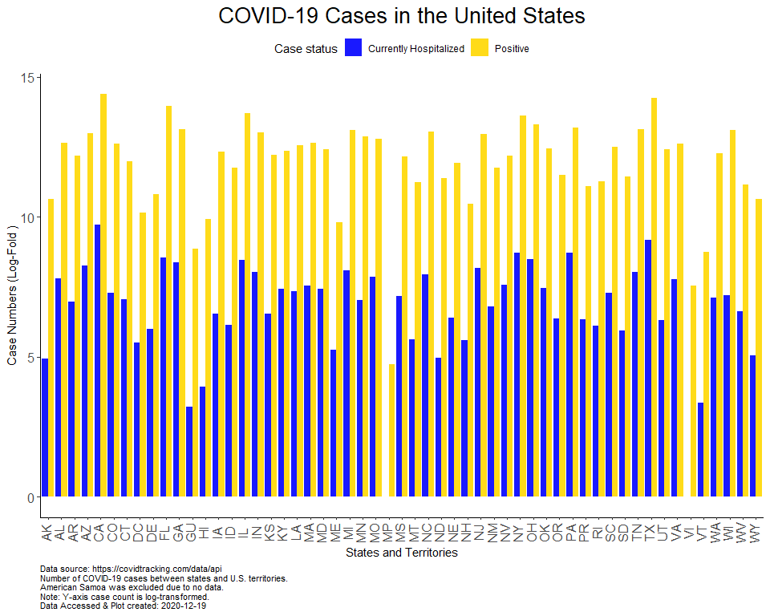
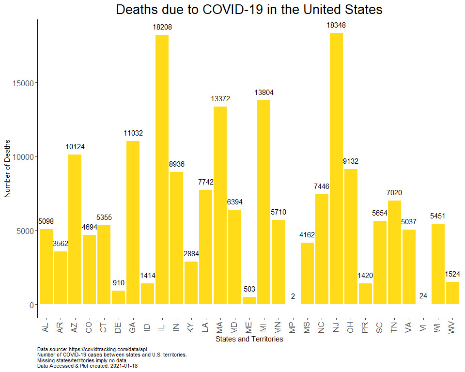
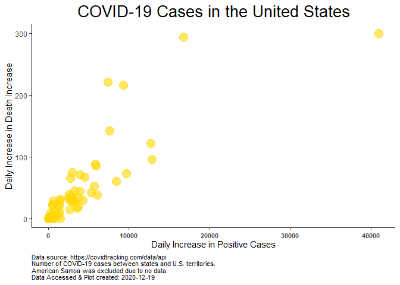
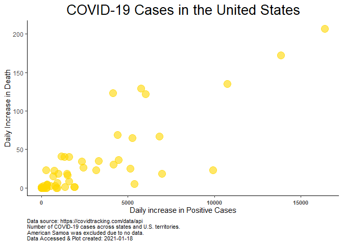
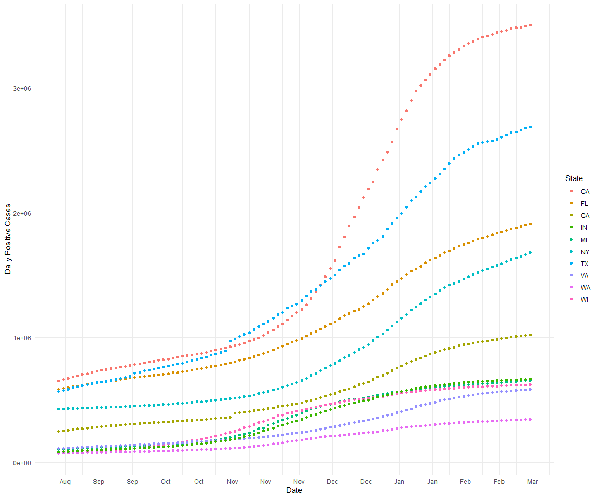
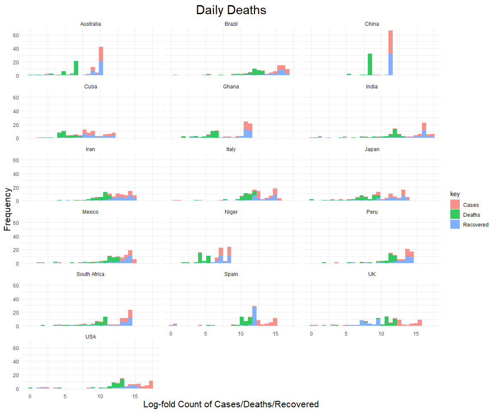
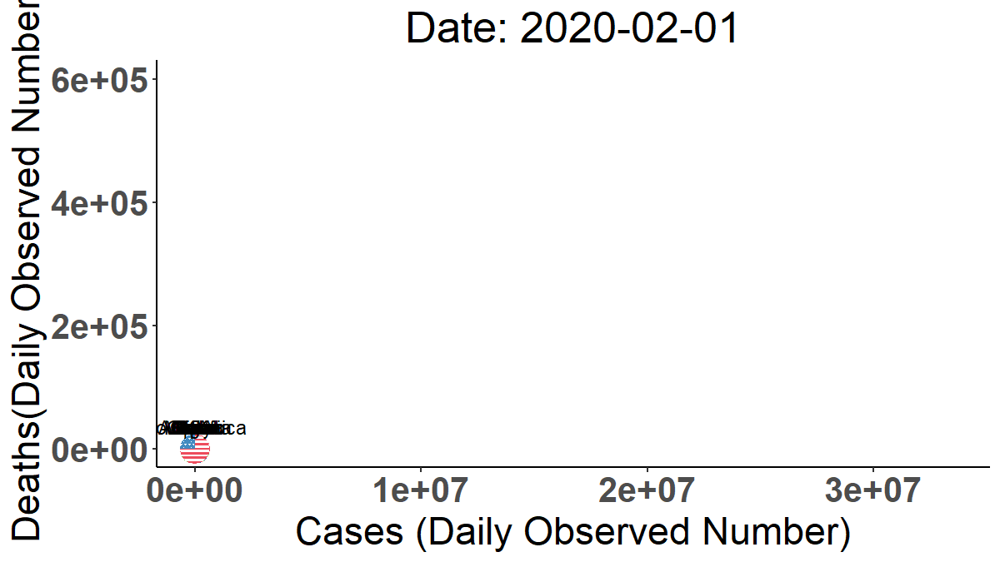
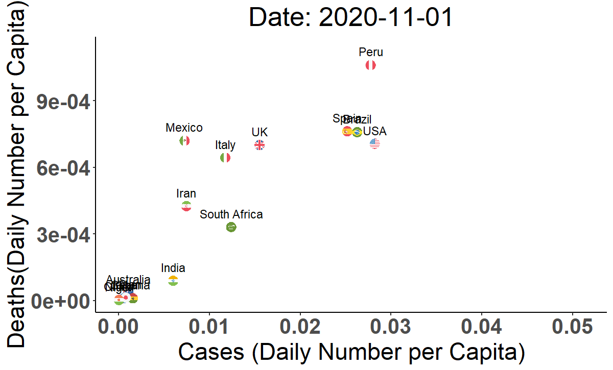

Exploring COVID Data
================
Sara Colom
12/8/2020

# Goals:

Prepare a report on current COVID cases and make cool maps showing COVID
cases.

1.  Load libraries
2.  Read in data from the COVID-tracking API and from project directory.

# Explore data

``` r
head(data)
```

    ##       date state positive probableCases negative pending totalTestResultsSource
    ## 1 20210307    AK    56886            NA       NA      NA        totalTestsViral
    ## 2 20210307    AL   499819        107742  1931711      NA  totalTestsPeopleViral
    ## 3 20210307    AR   324818         69092  2480716      NA        totalTestsViral
    ## 4 20210307    AS        0            NA     2140      NA        totalTestsViral
    ## 5 20210307    AZ   826454         56519  3073010      NA        totalTestsViral
    ## 6 20210307    CA  3501394            NA       NA      NA        totalTestsViral
    ##   totalTestResults hospitalizedCurrently hospitalizedCumulative inIcuCurrently
    ## 1          1731628                    33                   1293             NA
    ## 2          2323788                   494                  45976             NA
    ## 3          2736442                   335                  14926            141
    ## 4             2140                    NA                     NA             NA
    ## 5          7908105                   963                  57907            273
    ## 6         49646014                  4291                     NA           1159
    ##   inIcuCumulative onVentilatorCurrently onVentilatorCumulative recovered
    ## 1              NA                     2                     NA        NA
    ## 2            2676                    NA                   1515    295690
    ## 3              NA                    65                   1533    315517
    ## 4              NA                    NA                     NA        NA
    ## 5              NA                   143                     NA        NA
    ## 6              NA                    NA                     NA        NA
    ##      lastUpdateEt         dateModified checkTimeEt death hospitalized
    ## 1  3/5/2021 03:59 2021-03-05T03:59:00Z 03/04 22:59   305         1293
    ## 2  3/7/2021 11:00 2021-03-07T11:00:00Z 03/07 06:00 10148        45976
    ## 3  3/7/2021 00:00 2021-03-07T00:00:00Z 03/06 19:00  5319        14926
    ## 4 12/1/2020 00:00 2020-12-01T00:00:00Z 11/30 19:00     0           NA
    ## 5  3/7/2021 00:00 2021-03-07T00:00:00Z 03/06 19:00 16328        57907
    ## 6  3/7/2021 02:59 2021-03-07T02:59:00Z 03/06 21:59 54124           NA
    ##   hospitalizedDischarged          dateChecked totalTestsViral
    ## 1                     NA 2021-03-05T03:59:00Z         1731628
    ## 2                     NA 2021-03-07T11:00:00Z              NA
    ## 3                     NA 2021-03-07T00:00:00Z         2736442
    ## 4                     NA 2020-12-01T00:00:00Z            2140
    ## 5                 118932 2021-03-07T00:00:00Z         7908105
    ## 6                     NA 2021-03-07T02:59:00Z        49646014
    ##   positiveTestsViral negativeTestsViral positiveCasesViral deathConfirmed
    ## 1              68693            1660758                 NA             NA
    ## 2                 NA                 NA             392077           7963
    ## 3                 NA            2480716             255726           4308
    ## 4                 NA                 NA                  0             NA
    ## 5                 NA                 NA             769935          14403
    ## 6                 NA                 NA            3501394             NA
    ##   deathProbable totalTestEncountersViral totalTestsPeopleViral
    ## 1            NA                       NA                    NA
    ## 2          2185                       NA               2323788
    ## 3          1011                       NA                    NA
    ## 4            NA                       NA                    NA
    ## 5          1925                       NA               3842945
    ## 6            NA                       NA                    NA
    ##   totalTestsAntibody positiveTestsAntibody negativeTestsAntibody
    ## 1                 NA                    NA                    NA
    ## 2                 NA                    NA                    NA
    ## 3                 NA                    NA                    NA
    ## 4                 NA                    NA                    NA
    ## 5             580569                    NA                    NA
    ## 6                 NA                    NA                    NA
    ##   totalTestsPeopleAntibody positiveTestsPeopleAntibody
    ## 1                       NA                          NA
    ## 2                   119757                          NA
    ## 3                       NA                          NA
    ## 4                       NA                          NA
    ## 5                   444089                          NA
    ## 6                       NA                          NA
    ##   negativeTestsPeopleAntibody totalTestsPeopleAntigen
    ## 1                          NA                      NA
    ## 2                          NA                      NA
    ## 3                          NA                  481311
    ## 4                          NA                      NA
    ## 5                          NA                      NA
    ## 6                          NA                      NA
    ##   positiveTestsPeopleAntigen totalTestsAntigen positiveTestsAntigen fips
    ## 1                         NA                NA                   NA    2
    ## 2                         NA                NA                   NA    1
    ## 3                      81803                NA                   NA    5
    ## 4                         NA                NA                   NA   60
    ## 5                         NA                NA                   NA    4
    ## 6                         NA                NA                   NA    6
    ##   positiveIncrease negativeIncrease   total totalTestResultsIncrease  posNeg
    ## 1                0                0   56886                        0   56886
    ## 2              408             2087 2431530                     2347 2431530
    ## 3              165             3267 2805534                     3380 2805534
    ## 4                0                0    2140                        0    2140
    ## 5             1335            13678 3899464                    45110 3899464
    ## 6             3816                0 3501394                   133186 3501394
    ##   dataQualityGrade deathIncrease hospitalizedIncrease
    ## 1               NA             0                    0
    ## 2               NA            -1                    0
    ## 3               NA            22                   11
    ## 4               NA             0                    0
    ## 5               NA             5                   44
    ## 6               NA           258                    0
    ##                                       hash commercialScore negativeRegularScore
    ## 1 dc4bccd4bb885349d7e94d6fed058e285d4be164               0                    0
    ## 2 997207b430824ea40b8eb8506c19a93e07bc972e               0                    0
    ## 3 50921aeefba3e30d31623aa495b47fb2ecc72fae               0                    0
    ## 4 f77912d0b80d579fbb6202fa1a90554fc4dc1443               0                    0
    ## 5 0437a7a96f4471666f775e63e86923eb5cbd8cdf               0                    0
    ## 6 63c5c0fd2daef2fb65150e9db486de98ed3f7b72               0                    0
    ##   negativeScore positiveScore score grade
    ## 1             0             0     0    NA
    ## 2             0             0     0    NA
    ## 3             0             0     0    NA
    ## 4             0             0     0    NA
    ## 5             0             0     0    NA
    ## 6             0             0     0    NA

# Compare positive cases and hospitalized currently.

``` r
pos_hos <- data %>% 
  select(positive, hospitalizedCurrently) %>% 
  gather() %>% 
  mutate(state = rep(data %>% pull(state), times = 2))

pos_hos <- pos_hos %>% 
  mutate(key = recode(key,
                           hospitalizedCurrently = "Currently Hospitalized",
                            positive = "Positive"))
```

``` r
ggplot(pos_hos %>% 
         filter(state != "AS"), aes(state, log(value), fill = key)) +
  geom_bar(stat = "identity", position = "dodge", alpha = 0.9) +
  scale_fill_manual("Case status", values = c("blue", "gold")) +
  xlab("States and Territories") +
  ylab("Case Numbers (Log-Fold )") +
  ggtitle("COVID-19 Cases in the United States") +
  labs(caption = paste("Data source: https://covidtracking.com/data/api\nNumber of COVID-19 cases between states and U.S. territories.\nAmerican Samoa was excluded due to no data.\nNote: Y-axis case count is log-transformed.\nData Accessed & Plot created:",current_date)) +
  theme_classic() +
  theme(axis.text.x = element_text(angle = 90, vjust = 0.25, size = 12),
        axis.text.y = element_text(size = 12),
        plot.title = element_text(hjust = 0.5, size = 20),
         plot.caption = element_text(hjust = 0, size = 8)) +
  theme(legend.position = "top")
```

<!-- -->

COVID Deaths total between states and territories.

``` r
ggplot(data %>% 
         filter(!is.na(state)) %>% 
         filter(deathConfirmed != 0), aes(state, deathConfirmed)) +
  geom_bar(stat = "identity", position = "dodge", alpha = 0.9, fill = "gold", alpha = 0.8) +
  xlab("States and Territories") +
  ylab("Number of Deaths") +
  ggtitle("Deaths due to COVID-19 in the United States") +
  labs(caption = paste("Data source: https://covidtracking.com/data/api\nNumber of COVID-19 cases between states and U.S. territories.\nMissing states/territories imply no data.\nData Accessed & Plot created:", current_date)) +
  theme_classic() +
  geom_text(aes(label = deathConfirmed), vjust = -1) +
  theme(axis.text.x = element_text(angle = 90, vjust = 0.25, size = 12),
        axis.text.y = element_text(size = 12),
        plot.title = element_text(hjust = 0.5, size = 20),
         plot.caption = element_text(hjust = 0, size = 8)) +
  theme(legend.position = "top")
```

<!-- -->

Scatter plot of daily positive case increase versus daily death
increase.

``` r
ggplot(data %>% 
         filter(state != "AS"), aes(positiveIncrease, deathIncrease)) +
  geom_point(size = 5, color = "gold", alpha = 0.6) +
  xlab("Daily Increase in Positive Cases") +
  ylab("Daily Increase in Death Increase") +
  ggtitle("COVID-19 Cases in the United States") +
  labs(caption = paste("Data source: https://covidtracking.com/data/api\nNumber of COVID-19 cases between states and U.S. territories.\nAmerican Samoa was excluded due to no data.\nData Accessed & Plot created:", current_date)) +
  theme_classic() +
  theme(axis.text.x = element_text(vjust = 0.25, size = 8, face = "bold"),
        plot.title = element_text(hjust = 0.5, size = 20),
         plot.caption = element_text(hjust = 0, size = 8)) +
  theme(legend.position = "top")
```

<!-- -->

Scatterplot above w/o outlier (positive increase \> 24,000).

``` r
ggplot(data %>% 
         filter(state != "AS" & positiveIncrease < 24735), aes(positiveIncrease, deathIncrease)) +
  geom_point(size = 5, color = "gold", alpha = 0.6) +
  xlab("Daily increase in Positive Cases") +
  ylab("Daily Increase in Death") +
  ggtitle("COVID-19 Cases in the United States") +
  labs(caption = paste("Data source: https://covidtracking.com/data/api\nNumber of COVID-19 cases across states and U.S. territories.\nAmerican Samoa was excluded due to no data.\nData Accessed & Plot created:", current_date)) +
  theme_classic() +
  theme(axis.text.x = element_text(vjust = 0.25, size = 8, face = "bold"),
        plot.title = element_text(hjust = 0.5, size = 20),
         plot.caption = element_text(hjust = 0, size = 8)) +
  theme(legend.position = "top")
```

<!-- -->

# Mapping counts

1.  Combine the main data set with the info data set.

<!-- end list -->

``` r
data <- data %>% 
  rename(abbreviation = state)


data <- data %>% 
  left_join(info)
```

# State level trends

``` r
# Make vector of states to read in.

states <- c("ca", "mi", "ny", "fl", "ga", "tx", "wi", "wa", "va", "in")

state_data <- states %>% 
  purrr::map_df(~read_state(.))


# make date variables; one for month, year and day

iso <- "([0-9]{4})([0-1][0-9])([0-3][0-9])" # Year-Month-Day to match

dates <- rematch2::re_match(text = state_data %>% pull(date), pattern = iso) %>% 
  rename(Year = 1,
         Month = 2,
         Day = 3) %>% 
  unite("Date", c(Year, Month, Day), sep = "-", remove = FALSE)


# Incorporate data to the main data frame.  

state_data <- state_data %>% 
  left_join(
    dates %>% 
      rename(date = `.match`) %>% 
      mutate(date = as.integer(date)) %>% 
      select(- `.text`)
  )

rm(dates)
```

Observed positive cases

``` r
state_data <- state_data %>% 
  mutate(Date = ymd(Date))

ggplot(data = state_data) +
  geom_point(aes(x = Date, y = positive, color = state)) +
  ylab("Daily Positive Cases") +
  labs(color = "State") +
  theme_minimal()+
  scale_x_date(date_breaks = "2 weeks", date_labels = "%b")
```

<!-- -->

## Visualize

# Global trends

Prepare a scatter plot animation for multiple countries cases vs deaths.

First read in and wrangle data.

``` r
coun_res <- GET("https://corona.lmao.ninja/v2/historical?lastdays=all") # read in data

coun_data = fromJSON(rawToChar(coun_res$content)) # Convert json to tabular data

countrylist <- c("USA", 
                 "South Africa",
                 "Mexico", 
                 "UK", 
                 "Brazil",
                 "Italy",
                 "India",
                 "China",
                 "Australia",
                 "Cuba",
                 "Niger",
                 "Ghana",
                "Spain",
                "Japan",
                "Peru",
                "Iran"
                ) # Countries to analyze

# Index of countries
index <- coun_data %>%
  pull(country) %in% countrylist %>% 
  which()

# Dates to capture (1st and 15th day of each month) for 2020 and 2021

captdate_2020 <- c(paste(c(1:12), rep("1/20", times = 12), sep = "/"), # first day of month
           paste(c(1:12), rep("15/20", times = 12), sep = "/")) %>%  # 15th day of month
  mdy()

captdate <- c(c(paste(c(1:12), rep("1/21", times = 12), sep = "/"), # first day of month
           paste(c(1:12), rep("15/21", times = 12), sep = "/")) %>%  # 15th day of month
  mdy(),
captdate_2020)

remove(captdate_2020)

# Filter for specific countries
countries <- coun_data %>% 
  filter(country %in% countrylist) %>%
  pull(country)

# Save provinces
province <- coun_data %>% 
  filter(country %in% countrylist) %>%
  pull(province)

cases <- coun_data$timeline$cases %>% 
  slice(index) %>% 
  gather() %>% 
  rename(Date = key,
         Cases = value) %>% 
  mutate(Date = mdy(Date)) %>% 
  filter(Date %in% captdate)

cases <- cases %>% 
  mutate(Country = rep(countries, times = (nrow(cases)/length(index)))) %>% 
  mutate(Province =  rep(province, times = (nrow(cases)/length(index))))
  

deaths <- coun_data$timeline$deaths  %>% 
  slice(index) %>% 
  gather() %>% 
  rename(Date = key,
         Deaths = value) %>% 
  mutate(Date = mdy(Date)) %>% 
  filter(Date %in% captdate)

deaths <- deaths %>% 
  mutate(Country = rep(countries, times = (nrow(deaths)/length(index)))) %>% 
  mutate(Country = rep(countries, times = (nrow(deaths)/length(index)))) %>% 
  mutate(Province =  rep(province, times = (nrow(deaths)/length(index))))
  

recovered <- coun_data$timeline$recovered  %>% 
  slice(index) %>% 
  gather() %>% 
  rename(Date = key,
         Recovered = value) %>% 
  mutate(Date = mdy(Date)) %>% 
  filter(Date %in% captdate)

recovered <- recovered %>% 
  mutate(Country = rep(countries, times = (nrow(recovered)/length(index))))  %>% 
  mutate(Country = rep(countries, times = (nrow(recovered)/length(index)))) %>% 
  mutate(Province =  rep(province, times = (nrow(recovered)/length(index))))
  
total <- cases %>% 
  left_join(deaths) %>% 
  left_join(recovered)


rm(cases, deaths, recovered)


  

# Collapse to obtain the total of Cases, Deaths and Recovered by Country

total <- total %>% 
  group_by(Country, Date) %>% 
  summarise(Cases = sum(Cases), Deaths = sum(Deaths), Recovered = sum(Recovered)) %>% 
  ungroup()
```

Read in world population data and estimate a per capita per selected
country.

``` r
library(remotes)
library(WDI)

WDIsearch('population, total')
```

    ##           indicator                name 
    ##       "SP.POP.TOTL" "Population, total"

``` r
dat = WDI(indicator='SP.POP.TOTL', start = 2019, end=2019) %>% 
  mutate(country = case_when(
    country %in% "United States" ~ "USA",
    country %in% "United Kingdom" ~ "UK",
    country %in% "Iran, Islamic Rep." ~ "Iran",
    TRUE ~ country
  )) %>% 
  janitor::clean_names() %>% 
  filter(country %in% countrylist) %>% 
  rename(Country = country) 
  

# Merge population data

total <- total %>% 
  left_join(dat)

rm(dat)

# Estimate per capita cases, deaths and recovered


capita <- total %>% 
  group_by(Country, Date) %>% 
  summarise(capitaDeaths = Deaths/sp_pop_totl,
            capitaCases = Cases/sp_pop_totl,
            capitaRecovered = Recovered/sp_pop_totl
            )

total <- total %>% 
  left_join(capita)
```

## Data distribution

Summary stats

``` r
sum_total <- total %>% 
                group_by(Country) %>% 
                summarise(across(c(Cases, Deaths, Recovered), mean)) %>% 
                rename_at(vars(-Country),function(x) paste0(x,"_mean")) %>% 
                left_join(
                total %>% 
                  group_by(Country) %>% 
                  summarise(across(c(Cases, Deaths, Recovered), sd)) %>% 
                  rename_at(vars(-Country),function(x) paste0(x,"_sd"))
                ) %>% 
                select("Country", sort(colnames(.)))

sum_total
```

    ## # A tibble: 16 x 7
    ##    Country Cases_mean Cases_sd Deaths_mean Deaths_sd Recovered_mean Recovered_sd
    ##    <chr>        <dbl>    <dbl>       <dbl>     <dbl>          <dbl>        <dbl>
    ##  1 Austra~     19723.   1.15e4       563.      407.          15018.        9379.
    ##  2 Brazil    5960934.   5.54e6    163550.   145722.        5208338.     4947252.
    ##  3 China       89278.   1.61e4      4346.     1019.          80804.       22146.
    ##  4 Cuba        28898.   4.55e4       223.      277.          26699.       43038.
    ##  5 Ghana       44782.   3.40e4       320.      278.          42338.       33523.
    ##  6 India     7631980.   8.23e6    103264.    99129.        6927368.     7575165.
    ##  7 Iran       919819.   9.37e5     34377.    27417.         757767.      787215.
    ##  8 Italy     1437246.   1.55e6     56400.    40577.        1135049.     1364010.
    ##  9 Japan      210073.   2.45e5      3730.     4250.         185843.      223504.
    ## 10 Mexico    1009625.   9.11e5     94355.    81940.         793961.      718156.
    ## 11 Niger        2289.   1.99e3        92.7      66.5          1975.        1834.
    ## 12 Peru       794102.   6.47e5     77353.    58877.         719690.      640007.
    ## 13 South ~    752998.   6.37e5     22642.    21698.         677551.      602124.
    ## 14 Spain     1439070.   1.39e6     40735.    25562.         125313.       53108.
    ## 15 UK        1738954.   1.84e6     62175.    45210.           5261         5560.
    ## 16 USA      13323786.   1.27e7    268042.   208470.         893061.     1434813.

Per Capita Deaths

``` r
tot_long <- total %>%  
  select(Cases, Deaths, Recovered) %>% 
  gather() %>% 
  mutate(
    Country = rep(total$Country, 3),
    Date = rep(total$Date, 3)
  )

ggplot(tot_long) +
  geom_histogram(aes(log(value), fill = key),
                 alpha = 0.8,
                 bins = 50) +
  ggtitle("Daily Deaths") +
  ylab("Count log-fold") +
  xlab("Z-score") +
  theme_minimal() +
  facet_wrap(~ Country, ncol =3) +
  text_theme
```

<!-- -->

## Make animation

### Observed cases (not standardized)

``` r
total <- total %>% 
mutate(country = case_when(
                          Country %in% "Australia" ~ "au",
                          Country %in% "Brazil" ~ "br",
                          Country %in% "China" ~ "cn",
                          Country %in% "Cuba" ~ "cu",
                          Country %in% "Ghana" ~ "gh",
                           Country %in% "India" ~ "in",
                           Country %in% "Iran" ~ "ir",
                           Country %in% "Italy" ~ "it",
                           Country %in% "Japan" ~ "jp",
                           Country %in% "Mexico" ~ "mx",
                           Country %in% "Niger" ~ "ne",
                           Country %in% "Peru" ~ "pe",
                           Country %in% "South Africa" ~ "sa",
                           Country %in% "Spain" ~ "es",
                           Country %in% "UK" ~ "gb",
                           Country %in% "USA" ~ "us"))

p <- ggplot() +
  geom_flag(data = total, aes(x = Cases,
                y = Deaths, 
               country = country), size = 7) +
  ggtitle("COVID Cases & Deaths in Last 100 Days")  +
  scale_color_brewer(palette = "Set3") +
  scale_size(range = c(2, 12)) +
  #scale_x_log10() +
  labs(x = "Cases (Daily Observed Number)", y = "Deaths(Daily Observed Number)") +
  geom_text(data = total, aes(label = Country, x = Cases, y = Deaths), color = "black", vjust = -1) +
  theme_classic() +
  theme(axis.text= element_text(size = 20, face = "bold"),
        plot.title = element_text(hjust = 0.5, size = 25),
        axis.title = element_text(size = 22)) +
  theme(legend.position = "top")

animation <- p + transition_time(Date) +
  labs(title = "Date: {frame_time}")

animation <- animate(animation, height = 675, width = 1200, res = 150)

animation
```

<!-- -->

``` r
#anim_save(animation = animation, filename = "anim.gif")
```

### Observed cases per Capita (population standardized)

``` r
p2 <- ggplot() +
  geom_flag(data = total,
            aes(x = capitaCases, y = capitaDeaths, country = country),
            size = 4) +
  ggtitle("COVID Cases & Deaths in Last 100 Days")  +
  scale_color_brewer(palette = "Set3") +
  scale_size(range = c(2, 12)) +
  #scale_x_log10() +
  labs(x = "Cases (Daily Number per Capita)", y = "Deaths(Daily Number per Capita)") +
  geom_text(data = total,
            aes(x = capitaCases, y = capitaDeaths, label = Country),
            vjust = -1) +
  theme_classic() +
  theme(axis.text= element_text(size = 20, face = "bold"),
        plot.title = element_text(hjust = 0.5, size = 25),
        axis.title = element_text(size = 22)) +
  theme(legend.position = "top")

animation2 <- p2 + transition_time(Date) +
  labs(title = "Date: {frame_time}")

animation2 <- animate(animation2, height = 725, width = 1200, res = 150)

animation2
```

<!-- -->

``` r
#anim_save(animation = animation2, filename = "anim2.gif")
```
