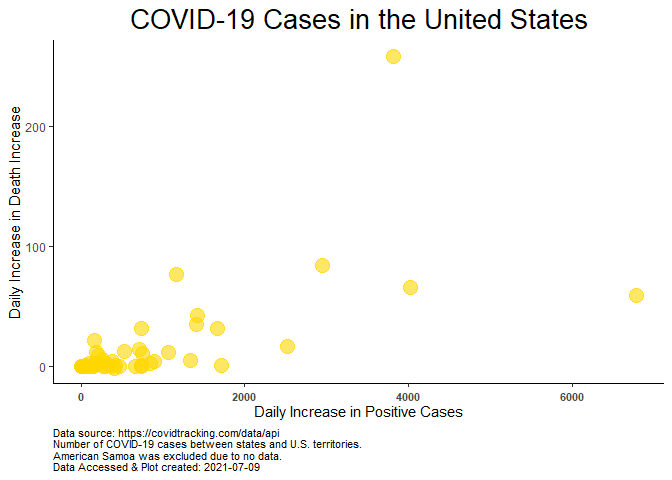
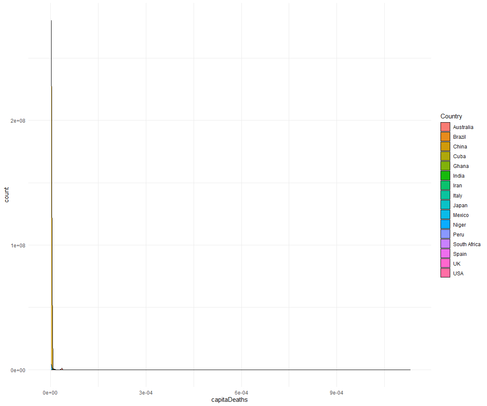

Exploring COVID Data
================
Sara Colom
12/8/2020

# Goals:

Prepare a report on current COVID cases and make cool maps showing COVID
cases.

1.  Load libraries
2.  Read in data from the covidtracking API and from project directory.

# Explore data

``` r
head(data)
```

    ##       date state positive probableCases negative pending totalTestResultsSource
    ## 1 20201218    AK    41905            NA  1143017      NA        totalTestsViral
    ## 2 20201218    AL   315683         58137  1507204      NA  totalTestsPeopleViral
    ## 3 20201218    AR   197421         29987  1746014      NA        totalTestsViral
    ## 4 20201218    AS        0            NA     2140      NA        totalTestsViral
    ## 5 20201218    AZ   442671         18072  2181193      NA        totalTestsViral
    ## 6 20201218    CA  1764374            NA 26976653      NA        totalTestsViral
    ##   totalTestResults hospitalizedCurrently hospitalizedCumulative inIcuCurrently
    ## 1          1184922                   142                    928             NA
    ## 2          1764750                  2447                  30224             NA
    ## 3          1913448                  1073                  10430            368
    ## 4             2140                    NA                     NA             NA
    ## 5          4514548                  3931                  32293            915
    ## 6         28741027                 16965                     NA           3553
    ##   inIcuCumulative onVentilatorCurrently onVentilatorCumulative recovered
    ## 1              NA                    13                     NA      7165
    ## 2            2384                    NA                   1371    183625
    ## 3              NA                   181                   1132    171864
    ## 4              NA                    NA                     NA        NA
    ## 5              NA                   601                     NA     65350
    ## 6              NA                    NA                     NA        NA
    ##   dataQualityGrade     lastUpdateEt         dateModified checkTimeEt death
    ## 1                A 12/18/2020 03:59 2020-12-18T03:59:00Z 12/17 22:59   183
    ## 2                A 12/18/2020 11:00 2020-12-18T11:00:00Z 12/18 06:00  4296
    ## 3               A+ 12/18/2020 00:00 2020-12-18T00:00:00Z 12/17 19:00  3139
    ## 4                D  12/1/2020 00:00 2020-12-01T00:00:00Z 11/30 19:00     0
    ## 5               A+ 12/18/2020 00:00 2020-12-18T00:00:00Z 12/17 19:00  7819
    ## 6                B 12/18/2020 02:59 2020-12-18T02:59:00Z 12/17 21:59 22160
    ##   hospitalized          dateChecked totalTestsViral positiveTestsViral
    ## 1          928 2020-12-18T03:59:00Z         1184922              50044
    ## 2        30224 2020-12-18T11:00:00Z              NA                 NA
    ## 3        10430 2020-12-18T00:00:00Z         1913448                 NA
    ## 4           NA 2020-12-01T00:00:00Z            2140                 NA
    ## 5        32293 2020-12-18T00:00:00Z         4514548                 NA
    ## 6           NA 2020-12-18T02:59:00Z        28741027                 NA
    ##   negativeTestsViral positiveCasesViral deathConfirmed deathProbable
    ## 1            1133565                 NA            183            NA
    ## 2                 NA             257546           3772           524
    ## 3            1746014             167434           2776           363
    ## 4                 NA                  0             NA            NA
    ## 5                 NA             424599           7142           677
    ## 6                 NA            1764374             NA            NA
    ##   totalTestEncountersViral totalTestsPeopleViral totalTestsAntibody
    ## 1                       NA                    NA                 NA
    ## 2                       NA               1764750                 NA
    ## 3                       NA                    NA                 NA
    ## 4                       NA                    NA                 NA
    ## 5                       NA               2605792             381780
    ## 6                       NA                    NA                 NA
    ##   positiveTestsAntibody negativeTestsAntibody totalTestsPeopleAntibody
    ## 1                    NA                    NA                       NA
    ## 2                    NA                    NA                    80872
    ## 3                    NA                    NA                       NA
    ## 4                    NA                    NA                       NA
    ## 5                    NA                    NA                       NA
    ## 6                    NA                    NA                       NA
    ##   positiveTestsPeopleAntibody negativeTestsPeopleAntibody
    ## 1                          NA                          NA
    ## 2                          NA                          NA
    ## 3                          NA                          NA
    ## 4                          NA                          NA
    ## 5                          NA                          NA
    ## 6                          NA                          NA
    ##   totalTestsPeopleAntigen positiveTestsPeopleAntigen totalTestsAntigen
    ## 1                      NA                         NA                NA
    ## 2                      NA                         NA                NA
    ## 3                  198712                      36355             21856
    ## 4                      NA                         NA                NA
    ## 5                      NA                         NA                NA
    ## 6                      NA                         NA                NA
    ##   positiveTestsAntigen fips positiveIncrease negativeIncrease    total
    ## 1                   NA    2              487             8712  1184922
    ## 2                   NA    1             5348             7855  1822887
    ## 3                 3300    5             2878            11752  1943435
    ## 4                   NA   60                0                0     2140
    ## 5                   NA    4             7635            15289  2623864
    ## 6                   NA    6            41012           243657 28741027
    ##   totalTestResultsIncrease   posNeg deathIncrease hospitalizedIncrease
    ## 1                     9199  1184922             0                    7
    ## 2                    12037  1822887            42                  665
    ## 3                    13674  1943435            27                   73
    ## 4                        0     2140             0                    0
    ## 5                    51882  2623864           142                  442
    ## 6                   284669 28741027           300                    0
    ##                                       hash commercialScore negativeRegularScore
    ## 1 4863f26cfbc760628f882b7b8147ca9369309b67               0                    0
    ## 2 a3401e8349ad4a94de986e1065307218c3850bbe               0                    0
    ## 3 2f79d80cb5b5595d2f74109eebe0ae32ca41d78c               0                    0
    ## 4 b16a8a33adc75a80d68ddac6d8dcff2372bc23c5               0                    0
    ## 5 4f1ee05f52a20ff3e5c005e8d575660b3fee1a7b               0                    0
    ## 6 14cf8f046f6e5a9800e196f940be93dbf8f9928e               0                    0
    ##   negativeScore positiveScore score grade
    ## 1             0             0     0    NA
    ## 2             0             0     0    NA
    ## 3             0             0     0    NA
    ## 4             0             0     0    NA
    ## 5             0             0     0    NA
    ## 6             0             0     0    NA

# Compare positive cases and hospitalized currently.

``` r
pos_hos <- data %>% 
  select(positive, hospitalizedCurrently) %>% 
  gather() %>% 
  mutate(state = rep(data %>% pull(state), times = 2))

pos_hos <- pos_hos %>% 
  mutate(key = recode(key,
                           hospitalizedCurrently = "Currently Hospitalized",
                            positive = "Positive"))
```

``` r
ggplot(pos_hos %>% 
         filter(state != "AS"), aes(state, log(value), fill = key)) +
  geom_bar(stat = "identity", position = "dodge", alpha = 0.9) +
  scale_fill_manual("Case status", values = c("blue", "gold")) +
  xlab("States and Territories") +
  ylab("Case Numbers (Log-Fold )") +
  ggtitle("COVID-19 Cases in the United States") +
  labs(caption = paste("Data source: https://covidtracking.com/data/api\nNumber of COVID-19 cases between states and U.S. territories.\nAmerican Samoa was excluded due to no data.\nNote: Y-axis case count is log-transformed.\nData Accessed & Plot created:",current_date)) +
  theme_classic() +
  theme(axis.text.x = element_text(angle = 90, vjust = 0.25, size = 12),
        axis.text.y = element_text(size = 12),
        plot.title = element_text(hjust = 0.5, size = 20),
         plot.caption = element_text(hjust = 0, size = 8)) +
  theme(legend.position = "top")
```

<!-- -->

COVID Deaths total between states and territories.

``` r
ggplot(data %>% 
         filter(!is.na(state)) %>% 
         filter(deathConfirmed != 0), aes(state, deathConfirmed)) +
  geom_bar(stat = "identity", position = "dodge", alpha = 0.9, fill = "gold", alpha = 0.8) +
  xlab("States and Territories") +
  ylab("Number of Deaths") +
  ggtitle("Deaths due to COVID-19 in the United States") +
  labs(caption = paste("Data source: https://covidtracking.com/data/api\nNumber of COVID-19 cases between states and U.S. territories.\nMissing states/territories imply no data.\nData Accessed & Plot created:", current_date)) +
  theme_classic() +
  geom_text(aes(label = deathConfirmed), vjust = -1) +
  theme(axis.text.x = element_text(angle = 90, vjust = 0.25, size = 12),
        axis.text.y = element_text(size = 12),
        plot.title = element_text(hjust = 0.5, size = 20),
         plot.caption = element_text(hjust = 0, size = 8)) +
  theme(legend.position = "top")
```

<!-- -->

Scatter plot of daily positive case increase versus daily death
increase.

``` r
ggplot(data %>% 
         filter(state != "AS"), aes(positiveIncrease, deathIncrease)) +
  geom_point(size = 5, color = "gold", alpha = 0.6) +
  xlab("Daily Increase in Positive Cases") +
  ylab("Daily Increase in Death Increase") +
  ggtitle("COVID-19 Cases in the United States") +
  labs(caption = paste("Data source: https://covidtracking.com/data/api\nNumber of COVID-19 cases between states and U.S. territories.\nAmerican Samoa was excluded due to no data.\nData Accessed & Plot created:", current_date)) +
  theme_classic() +
  theme(axis.text.x = element_text(vjust = 0.25, size = 8, face = "bold"),
        plot.title = element_text(hjust = 0.5, size = 20),
         plot.caption = element_text(hjust = 0, size = 8)) +
  theme(legend.position = "top")
```

<!-- -->

Scatterplot above w/o outlier (positive increase \> 24,000).

``` r
ggplot(data %>% 
         filter(state != "AS" & positiveIncrease < 24735), aes(positiveIncrease, deathIncrease)) +
  geom_point(size = 5, color = "gold", alpha = 0.6) +
  xlab("Daily increase in Positive Cases") +
  ylab("Daily Increase in Death") +
  ggtitle("COVID-19 Cases in the United States") +
  labs(caption = paste("Data source: https://covidtracking.com/data/api\nNumber of COVID-19 cases across states and U.S. territories.\nAmerican Samoa was excluded due to no data.\nData Accessed & Plot created:", current_date)) +
  theme_classic() +
  theme(axis.text.x = element_text(vjust = 0.25, size = 8, face = "bold"),
        plot.title = element_text(hjust = 0.5, size = 20),
         plot.caption = element_text(hjust = 0, size = 8)) +
  theme(legend.position = "top")
```

<!-- -->

# Mapping counts

1.  Combine the main data set with the info data set.

<!-- end list -->

``` r
data <- data %>% 
  rename(abbreviation = state)


data <- data %>% 
  left_join(info)
```

# Cases in California example

``` r
ca <- read.csv("https://api.covidtracking.com/v1/states/ca/daily.csv")


# make date variables; one for month, year and day

iso <- "([0-9]{4})([0-1][0-9])([0-3][0-9])" # Year-Month-Day to match

dates <- rematch2::re_match(text = ca %>% pull(date), pattern = iso) %>% 
  rename(Year = 1,
         Month = 2,
         Day = 3) %>% 
  unite("Date", c(Year, Month, Day), sep = "-", remove = FALSE)


# Incorporate data to the main data frame.  
```

# Global trends

Prepare a scatter plot animation for multiple countries cases vs deaths.

First read in and wrangle data.

``` r
coun_res <- GET("https://corona.lmao.ninja/v2/historical?lastdays=100") # read in data

coun_data = fromJSON(rawToChar(coun_res$content)) # Convert json to tabular data

countrylist <- c("USA", "South Africa", "Mexico", "UK", "Brazil", "Italy", "India", "China","Australia") # Countries to analyze

# Index of countries
index <- coun_data %>%
  pull(country) %in% countrylist %>% 
  which()

# Dates to capture (1st and 15th day of each month)

captdate <- c(paste(c(1:12), rep("1/20", times = 12), sep = "/"), # first day of month
           paste(c(1:12), rep("15/20", times = 12), sep = "/")) %>%  # 15th day of month
  mdy()


cases <- coun_data$timeline$cases %>% 
  slice(index) %>% 
  gather() %>% 
  rename(Date = key, Cases = value) %>% 
  mutate(Date = mdy(Date)) %>% 
  filter(Date %in% captdate)
  

deaths <- coun_data$timeline$deaths  %>% 
  slice(index) %>% 
  gather() %>% 
  rename(Date = key, Deaths = value) %>% 
  mutate(Date = mdy(Date)) %>% 
  filter(Date %in% captdate)

recovered <- coun_data$timeline$recovered  %>% 
  slice(index) %>% 
  gather() %>% 
  rename(Date = key, Recovered = value) %>% 
  mutate(Date = mdy(Date)) %>% 
  filter(Date %in% captdate)

total <- cases %>% 
  left_join(deaths, by = "Date") %>% 
  left_join(recovered, by = "Date")


rm(cases, deaths, recovered)

total <- total %>% 
  mutate(Country = rep(coun_data %>%
                         slice(index) %>% 
                         pull(country), times = nrow(total)/length(index)),
         Province = rep(coun_data %>%
                          slice(index) %>% 
                          pull(province), times = nrow(total)/length(index)))

# Collapse to obtain the total of Cases, Deaths and Recovered by Country

total <- total %>% 
  group_by(Country, Date) %>% 
  summarise(Cases = sum(Cases), Deaths = sum(Deaths), Recovered = sum(Recovered))
```

Read in world population data and estimate a per capita per selected
country.

``` r
library(remotes)
library(WDI)

WDIsearch('population, total')
```

    ##           indicator                name 
    ##       "SP.POP.TOTL" "Population, total"

``` r
dat = WDI(indicator='SP.POP.TOTL', start = 2019, end=2019) %>% 
  filter(country %in% countrylist) %>% 
  janitor::clean_names() %>% 
  rename(Country = country) 
  

# Merge population data

total <- total %>% 
  left_join(dat)

rm(dat)

# Estimate per capita cases, deaths and recovered


capita <- total %>% 
  group_by(Country, Date) %>% 
  summarise(capitaDeaths = Deaths/sp_pop_totl,
            capitaCases = Cases/sp_pop_totl,
            capitaRecovered = Recovered/sp_pop_totl
            )

total <- total %>% 
  left_join(capita)
```

## Data distribution

Summary stats

``` r
sum_total <- total %>% 
                ungroup(Date) %>% 
                summarise(across(c(Cases, Deaths, Recovered), mean)) %>% 
                rename_at(vars(-Country),function(x) paste0(x,"_mean")) %>% 
                left_join(
                total %>% 
                  ungroup(Date) %>% 
                  summarise(across(c(Cases, Deaths, Recovered), sd)) %>% 
                  rename_at(vars(-Country),function(x) paste0(x,"_sd"))
                ) %>% 
                select("Country", sort(colnames(.)))

sum_total
```

    ## # A tibble: 9 x 7
    ##   Country  Cases_mean Cases_sd Deaths_mean Deaths_sd Recovered_mean Recovered_sd
    ##   <chr>         <dbl>    <dbl>       <dbl>     <dbl>          <dbl>        <dbl>
    ## 1 Austral~    1.28e10  3.61e 9  338284901.    5.29e7      84396993.     2377754.
    ## 2 Brazil      1.60e 9  4.51e 8   42285613.    6.61e6   16751823734.  2803108527.
    ## 3 China       5.29e10  1.49e10 1395425215.    2.18e8     290431901.     3543067.
    ## 4 India       1.60e 9  4.51e 8   42285613.    6.61e6   23995743594.  6709286775.
    ## 5 Italy       1.60e 9  4.51e 8   42285613.    6.61e6    1599651202.  1194942912.
    ## 6 Mexico      1.60e 9  4.51e 8   42285613.    6.61e6    2504459074.   415915109.
    ## 7 South A~    1.60e 9  4.51e 8   42285613.    6.61e6    2242978718.   223814094.
    ## 8 UK          1.76e10  4.96e 9  465141738.    7.27e7       9982430.     2303514.
    ## 9 USA         1.60e 9  4.51e 8   42285613.    6.61e6   10363627622.  5492666454.

Per Capita Deaths

``` r
ggplot(total) +
  geom_histogram(aes(capitaDeaths), bins = 50) +
  theme_minimal()
```

<!-- -->

## Make animation

``` r
xlow <- total %>% 
  pull(capitaCases) %>% 
  min()

xhigh <- total %>% 
  pull(capitaCases) %>% 
  max()

ylow <- total %>% 
  pull(capitaDeaths) %>% 
  min()

yhigh <- total %>% 
  pull(capitaDeaths) %>% 
  max()

p <- ggplot(
  total, 
  aes(x = capitaCases, y = log(capitaDeaths), color = Country)
  ) +
  geom_point(alpha = 0.7, size = 5) +
  ggtitle("COVID Cases & Deaths in Last 100 Days")  +
  scale_color_brewer(palette = "Set3") +
  scale_size(range = c(2, 12)) +
  xlim(xlow, xhigh) +
  ylim(ylow, yhigh) +
  #scale_x_log10() +
  labs(x = "Per Capita Cases", y = "Per Capita Deaths") +
  theme_classic() +
  theme(axis.text.x = element_text(vjust = 0.25, size = 8, face = "bold"),
        plot.title = element_text(hjust = 0.5, size = 20),
         plot.caption = element_text(hjust = 0, size = 8)) +
  theme(legend.position = "top")

animation <- p + transition_time(Date) +
  labs(title = "Date: {frame_time}")

animation
```

<!-- -->
