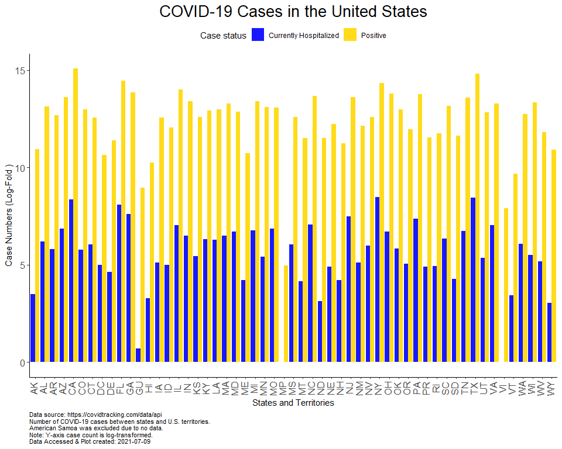

Exploring COVID Data
================
Sara Colom
12/8/2020

# Goals:

Prepare a report on current COVID cases and make cool maps showing COVID
cases.

1.  Load libraries
2.  Read in data from the covidtracking API and from project directory.

# Explore data

``` r
head(data)
```

    ##       date state positive probableCases negative pending totalTestResultsSource
    ## 1 20201217    AK    41418            NA  1134305      NA        totalTestsViral
    ## 2 20201217    AL   310335         56971  1499349      NA  totalTestsPeopleViral
    ## 3 20201217    AR   194543         29031  1734262      NA        totalTestsViral
    ## 4 20201217    AS        0            NA     2140      NA        totalTestsViral
    ## 5 20201217    AZ   435036         17546  2165904      NA        totalTestsViral
    ## 6 20201217    CA  1723362            NA 26732996      NA        totalTestsViral
    ##   totalTestResults hospitalizedCurrently hospitalizedCumulative inIcuCurrently
    ## 1          1175723                   140                    921             NA
    ## 2          1752713                  2425                  29559             NA
    ## 3          1899774                  1084                  10357            374
    ## 4             2140                    NA                     NA             NA
    ## 5          4462666                  3884                  31851            899
    ## 6         28456358                 16426                     NA           3392
    ##   inIcuCumulative onVentilatorCurrently onVentilatorCumulative recovered
    ## 1              NA                    14                     NA      7165
    ## 2            2383                    NA                   1369    183625
    ## 3              NA                   188                   1125    169745
    ## 4              NA                    NA                     NA        NA
    ## 5              NA                   618                     NA     64500
    ## 6              NA                    NA                     NA        NA
    ##   dataQualityGrade     lastUpdateEt         dateModified checkTimeEt death
    ## 1                A 12/17/2020 03:59 2020-12-17T03:59:00Z 12/16 22:59   183
    ## 2                A 12/17/2020 11:00 2020-12-17T11:00:00Z 12/17 06:00  4254
    ## 3               A+ 12/17/2020 00:00 2020-12-17T00:00:00Z 12/16 19:00  3112
    ## 4                D  12/1/2020 00:00 2020-12-01T00:00:00Z 11/30 19:00     0
    ## 5               A+ 12/17/2020 00:00 2020-12-17T00:00:00Z 12/16 19:00  7677
    ## 6                B 12/17/2020 02:59 2020-12-17T02:59:00Z 12/16 21:59 21860
    ##   hospitalized          dateChecked totalTestsViral positiveTestsViral
    ## 1          921 2020-12-17T03:59:00Z         1175723              49566
    ## 2        29559 2020-12-17T11:00:00Z              NA                 NA
    ## 3        10357 2020-12-17T00:00:00Z         1899774                 NA
    ## 4           NA 2020-12-01T00:00:00Z            2140                 NA
    ## 5        31851 2020-12-17T00:00:00Z         4462666                 NA
    ## 6           NA 2020-12-17T02:59:00Z        28456358                 NA
    ##   negativeTestsViral positiveCasesViral deathConfirmed deathProbable
    ## 1            1124849                 NA            183            NA
    ## 2                 NA             253364           3745           509
    ## 3            1734262             165512           2755           357
    ## 4                 NA                  0             NA            NA
    ## 5                 NA             417490           7040           637
    ## 6                 NA            1723362             NA            NA
    ##   totalTestEncountersViral totalTestsPeopleViral totalTestsAntibody
    ## 1                       NA                    NA                 NA
    ## 2                       NA               1752713                 NA
    ## 3                       NA                    NA                 NA
    ## 4                       NA                    NA                 NA
    ## 5                       NA               2583394             381042
    ## 6                       NA                    NA                 NA
    ##   positiveTestsAntibody negativeTestsAntibody totalTestsPeopleAntibody
    ## 1                    NA                    NA                       NA
    ## 2                    NA                    NA                    80026
    ## 3                    NA                    NA                       NA
    ## 4                    NA                    NA                       NA
    ## 5                    NA                    NA                       NA
    ## 6                    NA                    NA                       NA
    ##   positiveTestsPeopleAntibody negativeTestsPeopleAntibody
    ## 1                          NA                          NA
    ## 2                          NA                          NA
    ## 3                          NA                          NA
    ## 4                          NA                          NA
    ## 5                          NA                          NA
    ## 6                          NA                          NA
    ##   totalTestsPeopleAntigen positiveTestsPeopleAntigen totalTestsAntigen
    ## 1                      NA                         NA                NA
    ## 2                      NA                         NA                NA
    ## 3                  194199                      35233             21856
    ## 4                      NA                         NA                NA
    ## 5                      NA                         NA                NA
    ## 6                      NA                         NA                NA
    ##   positiveTestsAntigen fips positiveIncrease negativeIncrease    total
    ## 1                   NA    2              377             9201  1175723
    ## 2                   NA    1             4695             8070  1809684
    ## 3                 3300    5             3039            11404  1928805
    ## 4                   NA   60                0                0     2140
    ## 5                   NA    4             5817            17714  2600940
    ## 6                   NA    6            52281           254487 28456358
    ##   totalTestResultsIncrease   posNeg deathIncrease hospitalizedIncrease
    ## 1                     9578  1175723             2                    0
    ## 2                    11585  1809684            56                    0
    ## 3                    13686  1928805            38                  127
    ## 4                        0     2140             0                    0
    ## 5                    53583  2600940           147                  383
    ## 6                   306768 28456358           379                    0
    ##                                       hash commercialScore negativeRegularScore
    ## 1 35eda35e6c6987a9f6dac3396beff3b60e2dc49f               0                    0
    ## 2 b357032f7d16c426a76c064235896ed63f6202b7               0                    0
    ## 3 ce1ac026a38b10533d78a601bd83611f1e0880ad               0                    0
    ## 4 e410d5579aee323668e557db64dc42ce339d46a8               0                    0
    ## 5 322b661ae7d4134d63ad6c2fe4100d45b20abc8f               0                    0
    ## 6 87f815eb53ef00cfe939b63c108f3cd9df2c5bda               0                    0
    ##   negativeScore positiveScore score grade
    ## 1             0             0     0    NA
    ## 2             0             0     0    NA
    ## 3             0             0     0    NA
    ## 4             0             0     0    NA
    ## 5             0             0     0    NA
    ## 6             0             0     0    NA

# Compare positive cases and hospitalized currently.

``` r
pos_hos <- data %>% 
  select(positive, hospitalizedCurrently) %>% 
  gather() %>% 
  mutate(state = rep(data %>% pull(state), times = 2))

pos_hos <- pos_hos %>% 
  mutate(key = recode(key,
                           hospitalizedCurrently = "Currently Hospitalized",
                            positive = "Positive"))
```

``` r
ggplot(pos_hos %>% 
         filter(state != "AS"), aes(state, log(value), fill = key)) +
  geom_bar(stat = "identity", position = "dodge", alpha = 0.9) +
  scale_fill_manual("Case status", values = c("blue", "gold")) +
  xlab("States and Territories") +
  ylab("Case Numbers (Log-Fold )") +
  ggtitle("COVID-19 Cases in the United States") +
  labs(caption = paste("Data source: https://covidtracking.com/data/api\nNumber of COVID-19 cases between states and U.S. territories.\nAmerican Samoa was excluded due to no data.\nNote: Y-axis case count is log-transformed.\nData Accessed & Plot created:",current_date)) +
  theme_classic() +
  theme(axis.text.x = element_text(angle = 90, vjust = 0.25, size = 12),
        axis.text.y = element_text(size = 12),
        plot.title = element_text(hjust = 0.5, size = 20),
         plot.caption = element_text(hjust = 0, size = 8)) +
  theme(legend.position = "top")
```

<!-- -->

COVID Deaths total between states and territories.

``` r
ggplot(data %>% 
         filter(!is.na(state)) %>% 
         filter(deathConfirmed != 0), aes(state, deathConfirmed)) +
  geom_bar(stat = "identity", position = "dodge", alpha = 0.9, fill = "gold", alpha = 0.8) +
  xlab("States and Territories") +
  ylab("Number of Deaths") +
  ggtitle("Deaths due to COVID-19 in the United States") +
  labs(caption = paste("Data source: https://covidtracking.com/data/api\nNumber of COVID-19 cases between states and U.S. territories.\nMissing states/territories imply no data.\nData Accessed & Plot created:", current_date)) +
  theme_classic() +
  geom_text(aes(label = deathConfirmed), vjust = -1) +
  theme(axis.text.x = element_text(angle = 90, vjust = 0.25, size = 12),
        axis.text.y = element_text(size = 12),
        plot.title = element_text(hjust = 0.5, size = 20),
         plot.caption = element_text(hjust = 0, size = 8)) +
  theme(legend.position = "top")
```

<!-- -->

Scatter plot of daily positive case increase versus daily death
increase.

``` r
ggplot(data %>% 
         filter(state != "AS"), aes(positiveIncrease, deathIncrease)) +
  geom_point(size = 5, color = "gold", alpha = 0.6) +
  xlab("Daily Increase in Positive Cases") +
  ylab("Daily Increase in Death Increase") +
  ggtitle("COVID-19 Cases in the United States") +
  labs(caption = paste("Data source: https://covidtracking.com/data/api\nNumber of COVID-19 cases between states and U.S. territories.\nAmerican Samoa was excluded due to no data.\nData Accessed & Plot created:", current_date)) +
  theme_classic() +
  theme(axis.text.x = element_text(vjust = 0.25, size = 8, face = "bold"),
        plot.title = element_text(hjust = 0.5, size = 20),
         plot.caption = element_text(hjust = 0, size = 8)) +
  theme(legend.position = "top")
```

<!-- -->

Scatterplot above w/o outlier (positive increase \> 24,000).

``` r
ggplot(data %>% 
         filter(state != "AS" & positiveIncrease < 24735), aes(positiveIncrease, deathIncrease)) +
  geom_point(size = 5, color = "gold", alpha = 0.6) +
  xlab("Daily increase in Positive Cases") +
  ylab("Daily Increase in Death") +
  ggtitle("COVID-19 Cases in the United States") +
  labs(caption = paste("Data source: https://covidtracking.com/data/api\nNumber of COVID-19 cases across states and U.S. territories.\nAmerican Samoa was excluded due to no data.\nData Accessed & Plot created:", current_date)) +
  theme_classic() +
  theme(axis.text.x = element_text(vjust = 0.25, size = 8, face = "bold"),
        plot.title = element_text(hjust = 0.5, size = 20),
         plot.caption = element_text(hjust = 0, size = 8)) +
  theme(legend.position = "top")
```

<!-- -->

# Mapping counts

1.  Combine the main data set with the info data set.

<!-- end list -->

``` r
data <- data %>% 
  rename(abbreviation = state)


data <- data %>% 
  left_join(info)
```

# Cases in California example

``` r
ca <- read.csv("https://api.covidtracking.com/v1/states/ca/daily.csv")


# make date variables; one for month, year and day

iso <- "([0-9]{4})([0-1][0-9])([0-3][0-9])" # Year-Month-Day to match

dates <- rematch2::re_match(text = ca %>% pull(date), pattern = iso) %>% 
  rename(Year = 1,
         Month = 2,
         Day = 3) %>% 
  unite("Date", c(Year, Month, Day), sep = "-", remove = FALSE)


# Incorporate data to the main data frame.  
```

# Global trends

Prepare a scatter plot animation for multiple countries cases vs deaths.

``` r
coun_res <- GET("https://corona.lmao.ninja/v2/historical?lastdays=100") # read in data

coun_data = fromJSON(rawToChar(coun_res$content)) # Convert json to tabular data

countrylist <- c("USA", "South Africa", "Mexico", "UK", "Brazil", "Italy", "India", "China","Australia") # Countries to analyze

# Index of countries
index <- coun_data %>%
  pull(country) %in% countrylist %>% 
  which()

# Dates to capture (1st and 15th day of each month)

captdate <- c(paste(c(1:12), rep("1/20", times = 12), sep = "/"), # first day of month
           paste(c(1:12), rep("15/20", times = 12), sep = "/")) %>%  # 15th day of month
  mdy()


cases <- coun_data$timeline$cases %>% 
  slice(index) %>% 
  gather() %>% 
  rename(Date = key, Cases = value) %>% 
  mutate(Date = mdy(Date)) %>% 
  filter(Date %in% captdate)
  

deaths <- coun_data$timeline$deaths  %>% 
  slice(index) %>% 
  gather() %>% 
  rename(Date = key, Deaths = value) %>% 
  mutate(Date = mdy(Date)) %>% 
  filter(Date %in% captdate)

recovered <- coun_data$timeline$recovered  %>% 
  slice(index) %>% 
  gather() %>% 
  rename(Date = key, Recovered = value) %>% 
  mutate(Date = mdy(Date)) %>% 
  filter(Date %in% captdate)

total <- cases %>% 
  left_join(deaths, by = "Date") %>% 
  left_join(recovered, by = "Date")


rm(cases, deaths, recovered)

total <- total %>% 
  mutate(Country = rep(coun_data %>%
                         slice(index) %>% 
                         pull(country), times = nrow(total)/length(index)),
         Province = rep(coun_data %>%
                          slice(index) %>% 
                          pull(province), times = nrow(total)/length(index)))

# Collapse to obtain the total of Cases, Deaths and Recovered by Country

total <- total %>% 
  group_by(Country, Date) %>% 
  summarise(Cases = sum(Cases), Deaths = sum(Deaths), Recovered = sum(Recovered))
```

# Make animation

``` r
p <- ggplot(
  total, 
  aes(x = Cases, y = Deaths, color = Country)
  ) +
  geom_point(alpha = 0.7, size = 5) +
  ggtitle("COVID Cases & Deaths in Last 100 Days")  +
  scale_color_brewer(palette = "Set3") +
  scale_size(range = c(2, 12)) +
  scale_x_log10() +
  labs(x = "Cases", y = "Deaths") +
  theme_classic() +
  theme(axis.text.x = element_text(vjust = 0.25, size = 8, face = "bold"),
        plot.title = element_text(hjust = 0.5, size = 20),
         plot.caption = element_text(hjust = 0, size = 8)) +
  theme(legend.position = "top")

animation <- p + transition_time(Date) +
  labs(title = "Date: {frame_time}")

animation
```

<!-- -->
