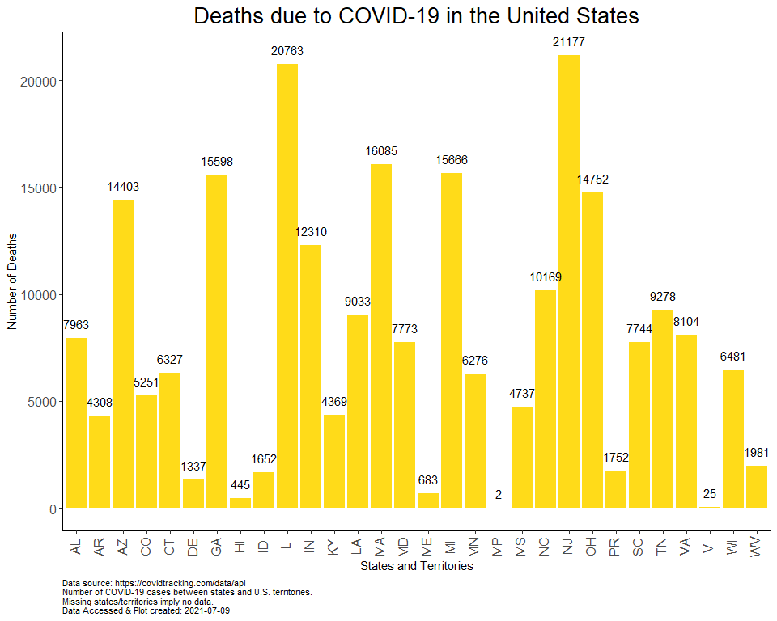
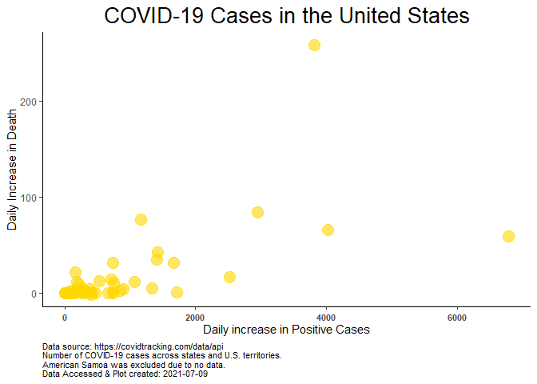
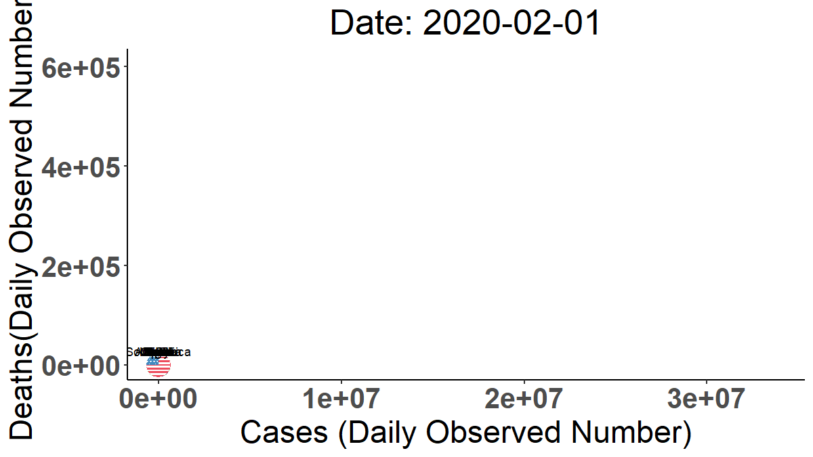

Exploring COVID Data
================
Sara Colom
12/8/2020

# Goals:

Prepare a report on current COVID cases and make cool maps showing COVID
cases.

1.  Load libraries
2.  Read in data from the COVID-tracking API and from project directory.

# Explore data

``` r
head(data)
```

    ##       date state positive probableCases negative pending totalTestResultsSource
    ## 1 20210207    AK    53279            NA       NA      NA        totalTestsViral
    ## 2 20210207    AL   472423        101367  1816273      NA  totalTestsPeopleViral
    ## 3 20210207    AR   306736         62862  2285451      NA        totalTestsViral
    ## 4 20210207    AS        0            NA     2140      NA        totalTestsViral
    ## 5 20210207    AZ   780637         50509  2818265      NA        totalTestsViral
    ## 6 20210207    CA  3335926            NA       NA      NA        totalTestsViral
    ##   totalTestResults hospitalizedCurrently hospitalizedCumulative inIcuCurrently
    ## 1          1536911                    44                   1219             NA
    ## 2          2187329                  1513                  43005             NA
    ## 3          2529325                   781                  14066            270
    ## 4             2140                    NA                     NA             NA
    ## 5          6982148                  2910                  54657            838
    ## 6         43994322                 12476                     NA           3339
    ##   inIcuCumulative onVentilatorCurrently onVentilatorCumulative recovered
    ## 1              NA                    11                     NA        NA
    ## 2            2576                    NA                   1460    252880
    ## 3              NA                   126                   1458    285306
    ## 4              NA                    NA                     NA        NA
    ## 5              NA                   561                     NA    107979
    ## 6              NA                    NA                     NA        NA
    ##   dataQualityGrade    lastUpdateEt         dateModified checkTimeEt death
    ## 1                A  2/5/2021 03:59 2021-02-05T03:59:00Z 02/04 22:59   279
    ## 2                A  2/7/2021 11:00 2021-02-07T11:00:00Z 02/07 06:00  8515
    ## 3               A+  2/6/2021 00:00 2021-02-06T00:00:00Z 02/05 19:00  5076
    ## 4              N/A 12/1/2020 00:00 2020-12-01T00:00:00Z 11/30 19:00     0
    ## 5               A+  2/7/2021 00:00 2021-02-07T00:00:00Z 02/06 19:00 14048
    ## 6                B  2/7/2021 02:59 2021-02-07T02:59:00Z 02/06 21:59 43942
    ##   hospitalized          dateChecked totalTestsViral positiveTestsViral
    ## 1         1219 2021-02-05T03:59:00Z         1536911              64404
    ## 2        43005 2021-02-07T11:00:00Z              NA                 NA
    ## 3        14066 2021-02-06T00:00:00Z         2529325                 NA
    ## 4           NA 2020-12-01T00:00:00Z            2140                 NA
    ## 5        54657 2021-02-07T00:00:00Z         6982148                 NA
    ## 6           NA 2021-02-07T02:59:00Z        43994322                 NA
    ##   negativeTestsViral positiveCasesViral deathConfirmed deathProbable
    ## 1            1470760                 NA             NA            NA
    ## 2                 NA             371056           6747          1768
    ## 3            2285451             243874           4054          1022
    ## 4                 NA                  0             NA            NA
    ## 5                 NA             730128          12480          1568
    ## 6                 NA            3335926             NA            NA
    ##   totalTestEncountersViral totalTestsPeopleViral totalTestsAntibody
    ## 1                       NA                    NA                 NA
    ## 2                       NA               2187329                 NA
    ## 3                       NA                    NA                 NA
    ## 4                       NA                    NA                 NA
    ## 5                       NA               3548393             423601
    ## 6                       NA                    NA                 NA
    ##   positiveTestsAntibody negativeTestsAntibody totalTestsPeopleAntibody
    ## 1                    NA                    NA                       NA
    ## 2                    NA                    NA                   109260
    ## 3                    NA                    NA                       NA
    ## 4                    NA                    NA                       NA
    ## 5                    NA                    NA                       NA
    ## 6                    NA                    NA                       NA
    ##   positiveTestsPeopleAntibody negativeTestsPeopleAntibody
    ## 1                          NA                          NA
    ## 2                          NA                          NA
    ## 3                          NA                          NA
    ## 4                          NA                          NA
    ## 5                          NA                          NA
    ## 6                          NA                          NA
    ##   totalTestsPeopleAntigen positiveTestsPeopleAntigen totalTestsAntigen
    ## 1                      NA                         NA                NA
    ## 2                      NA                         NA                NA
    ## 3                  389367                      73756                NA
    ## 4                      NA                         NA                NA
    ## 5                      NA                         NA                NA
    ## 6                      NA                         NA                NA
    ##   positiveTestsAntigen fips positiveIncrease negativeIncrease   total
    ## 1                   NA    2                0                0   53279
    ## 2                   NA    1             1112             4462 2288696
    ## 3                   NA    5              672             8180 2592187
    ## 4                   NA   60                0                0    2140
    ## 5                   NA    4             1544            16776 3598902
    ## 6                   NA    6            15064                0 3335926
    ##   totalTestResultsIncrease  posNeg deathIncrease hospitalizedIncrease
    ## 1                        0   53279             0                    0
    ## 2                     5308 2288696             2                    0
    ## 3                     8840 2592187            15                   17
    ## 4                        0    2140             0                    0
    ## 5                    59968 3598902            37                  150
    ## 6                   275167 3335926           295                    0
    ##                                       hash commercialScore negativeRegularScore
    ## 1 07a5d43f958541e9cdabb5ea34c8fb481835e130               0                    0
    ## 2 bde38ab9d426d29691fb40de1edeb285b1674fdc               0                    0
    ## 3 c2f88044a45b0669c5355b2cddbaca15de43c7f3               0                    0
    ## 4 80aa91d3878a87a2e94edb3586244a5df450d0bb               0                    0
    ## 5 380468038ad1b440ada7da318650aefc8e8a772d               0                    0
    ## 6 8652c6d586b9f8ea93717d06d90c6cf4e2a7cc9b               0                    0
    ##   negativeScore positiveScore score grade
    ## 1             0             0     0    NA
    ## 2             0             0     0    NA
    ## 3             0             0     0    NA
    ## 4             0             0     0    NA
    ## 5             0             0     0    NA
    ## 6             0             0     0    NA

# Compare positive cases and hospitalized currently.

``` r
pos_hos <- data %>% 
  select(positive, hospitalizedCurrently) %>% 
  gather() %>% 
  mutate(state = rep(data %>% pull(state), times = 2))

pos_hos <- pos_hos %>% 
  mutate(key = recode(key,
                           hospitalizedCurrently = "Currently Hospitalized",
                            positive = "Positive"))
```

``` r
ggplot(pos_hos %>% 
         filter(state != "AS"), aes(state, log(value), fill = key)) +
  geom_bar(stat = "identity", position = "dodge", alpha = 0.9) +
  scale_fill_manual("Case status", values = c("blue", "gold")) +
  xlab("States and Territories") +
  ylab("Case Numbers (Log-Fold )") +
  ggtitle("COVID-19 Cases in the United States") +
  labs(caption = paste("Data source: https://covidtracking.com/data/api\nNumber of COVID-19 cases between states and U.S. territories.\nAmerican Samoa was excluded due to no data.\nNote: Y-axis case count is log-transformed.\nData Accessed & Plot created:",current_date)) +
  theme_classic() +
  theme(axis.text.x = element_text(angle = 90, vjust = 0.25, size = 12),
        axis.text.y = element_text(size = 12),
        plot.title = element_text(hjust = 0.5, size = 20),
         plot.caption = element_text(hjust = 0, size = 8)) +
  theme(legend.position = "top")
```

<!-- -->

COVID Deaths total between states and territories.

``` r
ggplot(data %>% 
         filter(!is.na(state)) %>% 
         filter(deathConfirmed != 0), aes(state, deathConfirmed)) +
  geom_bar(stat = "identity", position = "dodge", alpha = 0.9, fill = "gold", alpha = 0.8) +
  xlab("States and Territories") +
  ylab("Number of Deaths") +
  ggtitle("Deaths due to COVID-19 in the United States") +
  labs(caption = paste("Data source: https://covidtracking.com/data/api\nNumber of COVID-19 cases between states and U.S. territories.\nMissing states/territories imply no data.\nData Accessed & Plot created:", current_date)) +
  theme_classic() +
  geom_text(aes(label = deathConfirmed), vjust = -1) +
  theme(axis.text.x = element_text(angle = 90, vjust = 0.25, size = 12),
        axis.text.y = element_text(size = 12),
        plot.title = element_text(hjust = 0.5, size = 20),
         plot.caption = element_text(hjust = 0, size = 8)) +
  theme(legend.position = "top")
```

<!-- -->

Scatter plot of daily positive case increase versus daily death
increase.

``` r
ggplot(data %>% 
         filter(state != "AS"), aes(positiveIncrease, deathIncrease)) +
  geom_point(size = 5, color = "gold", alpha = 0.6) +
  xlab("Daily Increase in Positive Cases") +
  ylab("Daily Increase in Death Increase") +
  ggtitle("COVID-19 Cases in the United States") +
  labs(caption = paste("Data source: https://covidtracking.com/data/api\nNumber of COVID-19 cases between states and U.S. territories.\nAmerican Samoa was excluded due to no data.\nData Accessed & Plot created:", current_date)) +
  theme_classic() +
  theme(axis.text.x = element_text(vjust = 0.25, size = 8, face = "bold"),
        plot.title = element_text(hjust = 0.5, size = 20),
         plot.caption = element_text(hjust = 0, size = 8)) +
  theme(legend.position = "top")
```

<!-- -->

Scatterplot above w/o outlier (positive increase \> 24,000).

``` r
ggplot(data %>% 
         filter(state != "AS" & positiveIncrease < 24735), aes(positiveIncrease, deathIncrease)) +
  geom_point(size = 5, color = "gold", alpha = 0.6) +
  xlab("Daily increase in Positive Cases") +
  ylab("Daily Increase in Death") +
  ggtitle("COVID-19 Cases in the United States") +
  labs(caption = paste("Data source: https://covidtracking.com/data/api\nNumber of COVID-19 cases across states and U.S. territories.\nAmerican Samoa was excluded due to no data.\nData Accessed & Plot created:", current_date)) +
  theme_classic() +
  theme(axis.text.x = element_text(vjust = 0.25, size = 8, face = "bold"),
        plot.title = element_text(hjust = 0.5, size = 20),
         plot.caption = element_text(hjust = 0, size = 8)) +
  theme(legend.position = "top")
```

<!-- -->

# Mapping counts

1.  Combine the main data set with the info data set.

<!-- end list -->

``` r
data <- data %>% 
  rename(abbreviation = state)


data <- data %>% 
  left_join(info)
```

# State level trends

``` r
# Make vector of states to read in.

states <- c("ca", "mi", "ny", "fl", "ga", "tx", "wi", "wa", "va", "in")

state_data <- states %>% 
  purrr::map_df(~read_state(.))


# make date variables; one for month, year and day

iso <- "([0-9]{4})([0-1][0-9])([0-3][0-9])" # Year-Month-Day to match

dates <- rematch2::re_match(text = state_data %>% pull(date), pattern = iso) %>% 
  rename(Year = 1,
         Month = 2,
         Day = 3) %>% 
  unite("Date", c(Year, Month, Day), sep = "-", remove = FALSE)


# Incorporate data to the main data frame.  

state_data <- state_data %>% 
  left_join(
    dates %>% 
      rename(date = `.match`) %>% 
      mutate(date = as.integer(date)) %>% 
      select(- `.text`)
  )

rm(dates)
```

Observed positive cases

``` r
ggplot(data = state_data) +
  geom_point(aes(x = Date, y = positive, color = state)) +
  ylab("Daily Positive Cases") +
  labs(color = "State") +
  theme_minimal()# +
```

<!-- -->

``` r
  #com_theme
```

## Visualize

# Global trends

Prepare a scatter plot animation for multiple countries cases vs deaths.

First read in and wrangle data.

``` r
coun_res <- GET("https://corona.lmao.ninja/v2/historical?lastdays=100") # read in data

coun_data = fromJSON(rawToChar(coun_res$content)) # Convert json to tabular data

countrylist <- c("USA", 
                 "South Africa",
                 "Mexico", 
                 "UK", 
                 "Brazil",
                 "Italy",
                 "India",
                 "China",
                 "Australia",
                 "Cuba",
                 "Niger",
                 "Ghana",
                "Spain",
                "Japan",
                "Peru",
                "Iran"
                ) # Countries to analyze

# Index of countries
index <- coun_data %>%
  pull(country) %in% countrylist %>% 
  which()

# Dates to capture (1st and 15th day of each month)

captdate <- c(paste(c(1:12), rep("1/20", times = 12), sep = "/"), # first day of month
           paste(c(1:12), rep("15/20", times = 12), sep = "/")) %>%  # 15th day of month
  mdy()

countries <- coun_data %>% 
  filter(country %in% countrylist) %>%
  pull(country)

province <- coun_data %>% 
  filter(country %in% countrylist) %>%
  pull(province)

cases <- coun_data$timeline$cases %>% 
  slice(index) %>% 
  gather() %>% 
  rename(Date = key,
         Cases = value) %>% 
  mutate(Date = mdy(Date)) %>% 
  filter(Date %in% captdate)

cases <- cases %>% 
  mutate(Country = rep(countries, times = (nrow(cases)/length(index)))) %>% 
  mutate(Province =  rep(province, times = (nrow(cases)/length(index))))
  

deaths <- coun_data$timeline$deaths  %>% 
  slice(index) %>% 
  gather() %>% 
  rename(Date = key,
         Deaths = value) %>% 
  mutate(Date = mdy(Date)) %>% 
  filter(Date %in% captdate)

deaths <- deaths %>% 
  mutate(Country = rep(countries, times = (nrow(deaths)/length(index)))) %>% 
  mutate(Country = rep(countries, times = (nrow(deaths)/length(index)))) %>% 
  mutate(Province =  rep(province, times = (nrow(deaths)/length(index))))
  

recovered <- coun_data$timeline$recovered  %>% 
  slice(index) %>% 
  gather() %>% 
  rename(Date = key,
         Recovered = value) %>% 
  mutate(Date = mdy(Date)) %>% 
  filter(Date %in% captdate)

recovered <- recovered %>% 
  mutate(Country = rep(countries, times = (nrow(recovered)/length(index))))  %>% 
  mutate(Country = rep(countries, times = (nrow(recovered)/length(index)))) %>% 
  mutate(Province =  rep(province, times = (nrow(recovered)/length(index))))
  
total <- cases %>% 
  left_join(deaths) %>% 
  left_join(recovered)


rm(cases, deaths, recovered)


  

# Collapse to obtain the total of Cases, Deaths and Recovered by Country

total <- total %>% 
  group_by(Country, Date) %>% 
  summarise(Cases = sum(Cases), Deaths = sum(Deaths), Recovered = sum(Recovered)) %>% 
  ungroup()
```

Read in world population data and estimate a per capita per selected
country.

``` r
library(remotes)
library(WDI)

WDIsearch('population, total')
```

    ##           indicator                name 
    ##       "SP.POP.TOTL" "Population, total"

``` r
dat = WDI(indicator='SP.POP.TOTL', start = 2019, end=2019) %>% 
  mutate(country = case_when(
    country %in% "United States" ~ "USA",
    country %in% "United Kingdom" ~ "UK",
    country %in% "Iran, Islamic Rep." ~ "Iran",
    TRUE ~ country
  )) %>% 
  janitor::clean_names() %>% 
  filter(country %in% countrylist) %>% 
  rename(Country = country) 
  

# Merge population data

total <- total %>% 
  left_join(dat)

rm(dat)

# Estimate per capita cases, deaths and recovered


capita <- total %>% 
  group_by(Country, Date) %>% 
  summarise(capitaDeaths = Deaths/sp_pop_totl,
            capitaCases = Cases/sp_pop_totl,
            capitaRecovered = Recovered/sp_pop_totl
            )

total <- total %>% 
  left_join(capita)
```

## Data distribution

Summary stats

``` r
sum_total <- total %>% 
                group_by(Country) %>% 
                summarise(across(c(Cases, Deaths, Recovered), mean)) %>% 
                rename_at(vars(-Country),function(x) paste0(x,"_mean")) %>% 
                left_join(
                total %>% 
                  group_by(Country) %>% 
                  summarise(across(c(Cases, Deaths, Recovered), sd)) %>% 
                  rename_at(vars(-Country),function(x) paste0(x,"_sd"))
                ) %>% 
                select("Country", sort(colnames(.)))

sum_total
```

    ## # A tibble: 16 x 7
    ##    Country Cases_mean Cases_sd Deaths_mean Deaths_sd Recovered_mean Recovered_sd
    ##    <chr>        <dbl>    <dbl>       <dbl>     <dbl>          <dbl>        <dbl>
    ##  1 Austra~     27833.     200.        908.     0.577         25529         149. 
    ##  2 Brazil    6191405.  624274.     170622   9883.          5555144.     519240. 
    ##  3 China       92694.    1400.       4745.     8.02          86999         886. 
    ##  4 Cuba         8124.    1141.        133      4.24           7400.        973. 
    ##  5 Ghana       50796     2196.        323      2.94          49514.       2142. 
    ##  6 India     9126600   746747.     133724.  9378.          8545868.     830398. 
    ##  7 Iran       870496   223143.      44522.  7692.           639187      151535. 
    ##  8 Italy     1344835.  511251.      51568. 11968.           659798.     382811. 
    ##  9 Japan      139070.   36631.       2085    359.           115718.      29578. 
    ## 10 Mexico    1081370.  147098.     103075. 10062.           826153       81414. 
    ## 11 Niger        1619.     519.         74      5.94           1209.         87.3
    ## 12 Peru       946784.   36208.      35593.   985.           874238       41363. 
    ## 13 South ~    785956.   64427.      21239.  1859.           711576.      47548. 
    ## 14 Spain     1515731.  253478.      42640.  5497.           150376           0  
    ## 15 UK        1487901   367621.      55747.  7981.             3411         549. 
    ## 16 USA      12762681  3288482.     263404  31566.          3258011     2270783.

Per Capita Deaths

``` r
ggplot(total) +
  geom_histogram(aes(capitaDeaths),
                 alpha = 0.8,
                 bins = 50) +
  theme_minimal()
```

<!-- -->

## Make animation

### Observed cases (not standardized)

``` r
total <- total %>% 
mutate(country = case_when(
                          Country %in% "Australia" ~ "au",
                          Country %in% "Brazil" ~ "br",
                          Country %in% "China" ~ "cn",
                          Country %in% "Cuba" ~ "cu",
                          Country %in% "Ghana" ~ "gh",
                           Country %in% "India" ~ "in",
                           Country %in% "Iran" ~ "ir",
                           Country %in% "Italy" ~ "it",
                           Country %in% "Japan" ~ "jp",
                           Country %in% "Mexico" ~ "mx",
                           Country %in% "Niger" ~ "ne",
                           Country %in% "Peru" ~ "pe",
                           Country %in% "South Africa" ~ "sa",
                           Country %in% "Spain" ~ "es",
                           Country %in% "UK" ~ "gb",
                           Country %in% "USA" ~ "us"))

p <- ggplot() +
  geom_flag(data = total, aes(x = Cases,
                y = Deaths, 
               country = country), size = 7) +
  ggtitle("COVID Cases & Deaths in Last 100 Days")  +
  scale_color_brewer(palette = "Set3") +
  scale_size(range = c(2, 12)) +
  #scale_x_log10() +
  labs(x = "Cases (Daily Observed Number)", y = "Deaths(Daily Observed Number)") +
  geom_text(data = total, aes(label = Country, x = Cases, y = Deaths), color = "black", vjust = -1) +
  theme_classic() +
  theme(axis.text= element_text(size = 20, face = "bold"),
        plot.title = element_text(hjust = 0.5, size = 25),
        axis.title = element_text(size = 22)) +
  theme(legend.position = "top")

animation <- p + transition_time(Date) +
  labs(title = "Date: {frame_time}")

animation <- animate(animation, height = 675, width = 1200, res = 150)

animation
```

<!-- -->

``` r
#anim_save(animation = animation, filename = "anim.gif")
```

### Observed cases per Capita (population standardized)

``` r
p2 <- ggplot() +
  geom_flag(data = total,
            aes(x = capitaCases, y = capitaDeaths, country = country),
            size = 4) +
  ggtitle("COVID Cases & Deaths in Last 100 Days")  +
  scale_color_brewer(palette = "Set3") +
  scale_size(range = c(2, 12)) +
  #scale_x_log10() +
  labs(x = "Cases (Daily Number per Capita)", y = "Deaths(Daily Number per Capita)") +
  geom_text(data = total,
            aes(x = capitaCases, y = capitaDeaths, label = Country),
            vjust = -1) +
  theme_classic() +
  theme(axis.text= element_text(size = 20, face = "bold"),
        plot.title = element_text(hjust = 0.5, size = 25),
        axis.title = element_text(size = 22)) +
  theme(legend.position = "top")

animation2 <- p2 + transition_time(Date) +
  labs(title = "Date: {frame_time}")

animation2 <- animate(animation2, height = 725, width = 1200, res = 150)

animation2
```

<!-- -->

``` r
#anim_save(animation = animation2, filename = "anim2.gif")
```
