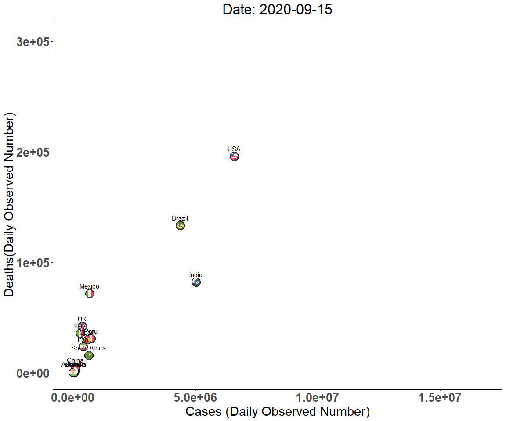

Exploring COVID Data
================
Sara Colom
12/8/2020

# Goals:

Prepare a report on current COVID cases and make cool maps showing COVID
cases.

1.  Load libraries
2.  Read in data from the COVID-tracking API and from project directory.

# Explore data

``` r
head(data)
```

    ##       date state positive probableCases negative pending totalTestResultsSource
    ## 1 20201219    AK    42235            NA  1150883      NA        totalTestsViral
    ## 2 20201219    AL   319904         59403  1514927      NA  totalTestsPeopleViral
    ## 3 20201219    AR   200114         30827  1757984      NA        totalTestsViral
    ## 4 20201219    AS        0            NA     2140      NA        totalTestsViral
    ## 5 20201219    AZ   448231         18672  2196578      NA        totalTestsViral
    ## 6 20201219    CA  1807982            NA 27304267      NA        totalTestsViral
    ##   totalTestResults hospitalizedCurrently hospitalizedCumulative inIcuCurrently
    ## 1          1193118                   146                    935             NA
    ## 2          1775428                  2318                  30224             NA
    ## 3          1927271                  1061                  10487            345
    ## 4             2140                    NA                     NA             NA
    ## 5          4563098                  4014                  32676            939
    ## 6         29112249                 17398                     NA           3620
    ##   inIcuCumulative onVentilatorCurrently onVentilatorCumulative recovered
    ## 1              NA                    13                     NA      7165
    ## 2            2389                    NA                   1377    183625
    ## 3              NA                   177                   1136    173832
    ## 4              NA                    NA                     NA        NA
    ## 5              NA                   612                     NA     66132
    ## 6              NA                    NA                     NA        NA
    ##   dataQualityGrade     lastUpdateEt         dateModified checkTimeEt death
    ## 1                A 12/19/2020 03:59 2020-12-19T03:59:00Z 12/18 22:59   184
    ## 2                A 12/19/2020 11:00 2020-12-19T11:00:00Z 12/19 06:00  4389
    ## 3               A+ 12/19/2020 00:00 2020-12-19T00:00:00Z 12/18 19:00  3191
    ## 4                D  12/1/2020 00:00 2020-12-01T00:00:00Z 11/30 19:00     0
    ## 5               A+ 12/19/2020 00:00 2020-12-19T00:00:00Z 12/18 19:00  7937
    ## 6                B 12/19/2020 02:59 2020-12-19T02:59:00Z 12/18 21:59 22432
    ##   hospitalized          dateChecked totalTestsViral positiveTestsViral
    ## 1          935 2020-12-19T03:59:00Z         1193118              50438
    ## 2        30224 2020-12-19T11:00:00Z              NA                 NA
    ## 3        10487 2020-12-19T00:00:00Z         1927271                 NA
    ## 4           NA 2020-12-01T00:00:00Z            2140                 NA
    ## 5        32676 2020-12-19T00:00:00Z         4563098                 NA
    ## 6           NA 2020-12-19T02:59:00Z        29112249                 NA
    ##   negativeTestsViral positiveCasesViral deathConfirmed deathProbable
    ## 1            1141344                 NA            184            NA
    ## 2                 NA             260501           3849           540
    ## 3            1757984             169287           2821           370
    ## 4                 NA                  0             NA            NA
    ## 5                 NA             429599           7246           691
    ## 6                 NA            1807982             NA            NA
    ##   totalTestEncountersViral totalTestsPeopleViral totalTestsAntibody
    ## 1                       NA                    NA                 NA
    ## 2                       NA               1775428                 NA
    ## 3                       NA                    NA                 NA
    ## 4                       NA                    NA                 NA
    ## 5                       NA               2626177             382700
    ## 6                       NA                    NA                 NA
    ##   positiveTestsAntibody negativeTestsAntibody totalTestsPeopleAntibody
    ## 1                    NA                    NA                       NA
    ## 2                    NA                    NA                    81525
    ## 3                    NA                    NA                       NA
    ## 4                    NA                    NA                       NA
    ## 5                    NA                    NA                       NA
    ## 6                    NA                    NA                       NA
    ##   positiveTestsPeopleAntibody negativeTestsPeopleAntibody
    ## 1                          NA                          NA
    ## 2                          NA                          NA
    ## 3                          NA                          NA
    ## 4                          NA                          NA
    ## 5                          NA                          NA
    ## 6                          NA                          NA
    ##   totalTestsPeopleAntigen positiveTestsPeopleAntigen totalTestsAntigen
    ## 1                      NA                         NA                NA
    ## 2                      NA                         NA                NA
    ## 3                  201974                      37260             21856
    ## 4                      NA                         NA                NA
    ## 5                      NA                         NA                NA
    ## 6                      NA                         NA                NA
    ##   positiveTestsAntigen fips positiveIncrease negativeIncrease    total
    ## 1                   NA    2              330             7866  1193118
    ## 2                   NA    1             4221             7723  1834831
    ## 3                 3300    5             2693            11970  1958098
    ## 4                   NA   60                0                0     2140
    ## 5                   NA    4             5560            15385  2644809
    ## 6                   NA    6            43608           327614 29112249
    ##   totalTestResultsIncrease   posNeg deathIncrease hospitalizedIncrease
    ## 1                     8196  1193118             1                    7
    ## 2                    10678  1834831            93                    0
    ## 3                    13823  1958098            52                   57
    ## 4                        0     2140             0                    0
    ## 5                    48550  2644809           118                  383
    ## 6                   371222 29112249           272                    0
    ##                                       hash commercialScore negativeRegularScore
    ## 1 ffa7f1c1f50f93cfb62396ee45bff033ea2ded2a               0                    0
    ## 2 68df3c8f4569c9d33646ce52eda57b6d22f07f74               0                    0
    ## 3 b634ee09b4a36af5b40fcde9aeefedb57060e580               0                    0
    ## 4 724b9522e4f931c541356fbb34c0a0859c78e331               0                    0
    ## 5 aa76bd1ca231d1d21bd9555510f83a9d7fcaf1d6               0                    0
    ## 6 469b836dcbf61759b09ccd4f802c2d355e7c71d9               0                    0
    ##   negativeScore positiveScore score grade
    ## 1             0             0     0    NA
    ## 2             0             0     0    NA
    ## 3             0             0     0    NA
    ## 4             0             0     0    NA
    ## 5             0             0     0    NA
    ## 6             0             0     0    NA

# Compare positive cases and hospitalized currently.

``` r
pos_hos <- data %>% 
  select(positive, hospitalizedCurrently) %>% 
  gather() %>% 
  mutate(state = rep(data %>% pull(state), times = 2))

pos_hos <- pos_hos %>% 
  mutate(key = recode(key,
                           hospitalizedCurrently = "Currently Hospitalized",
                            positive = "Positive"))
```

``` r
ggplot(pos_hos %>% 
         filter(state != "AS"), aes(state, log(value), fill = key)) +
  geom_bar(stat = "identity", position = "dodge", alpha = 0.9) +
  scale_fill_manual("Case status", values = c("blue", "gold")) +
  xlab("States and Territories") +
  ylab("Case Numbers (Log-Fold )") +
  ggtitle("COVID-19 Cases in the United States") +
  labs(caption = paste("Data source: https://covidtracking.com/data/api\nNumber of COVID-19 cases between states and U.S. territories.\nAmerican Samoa was excluded due to no data.\nNote: Y-axis case count is log-transformed.\nData Accessed & Plot created:",current_date)) +
  theme_classic() +
  theme(axis.text.x = element_text(angle = 90, vjust = 0.25, size = 12),
        axis.text.y = element_text(size = 12),
        plot.title = element_text(hjust = 0.5, size = 20),
         plot.caption = element_text(hjust = 0, size = 8)) +
  theme(legend.position = "top")
```

<!-- -->

COVID Deaths total between states and territories.

``` r
ggplot(data %>% 
         filter(!is.na(state)) %>% 
         filter(deathConfirmed != 0), aes(state, deathConfirmed)) +
  geom_bar(stat = "identity", position = "dodge", alpha = 0.9, fill = "gold", alpha = 0.8) +
  xlab("States and Territories") +
  ylab("Number of Deaths") +
  ggtitle("Deaths due to COVID-19 in the United States") +
  labs(caption = paste("Data source: https://covidtracking.com/data/api\nNumber of COVID-19 cases between states and U.S. territories.\nMissing states/territories imply no data.\nData Accessed & Plot created:", current_date)) +
  theme_classic() +
  geom_text(aes(label = deathConfirmed), vjust = -1) +
  theme(axis.text.x = element_text(angle = 90, vjust = 0.25, size = 12),
        axis.text.y = element_text(size = 12),
        plot.title = element_text(hjust = 0.5, size = 20),
         plot.caption = element_text(hjust = 0, size = 8)) +
  theme(legend.position = "top")
```

<!-- -->

Scatter plot of daily positive case increase versus daily death
increase.

``` r
ggplot(data %>% 
         filter(state != "AS"), aes(positiveIncrease, deathIncrease)) +
  geom_point(size = 5, color = "gold", alpha = 0.6) +
  xlab("Daily Increase in Positive Cases") +
  ylab("Daily Increase in Death Increase") +
  ggtitle("COVID-19 Cases in the United States") +
  labs(caption = paste("Data source: https://covidtracking.com/data/api\nNumber of COVID-19 cases between states and U.S. territories.\nAmerican Samoa was excluded due to no data.\nData Accessed & Plot created:", current_date)) +
  theme_classic() +
  theme(axis.text.x = element_text(vjust = 0.25, size = 8, face = "bold"),
        plot.title = element_text(hjust = 0.5, size = 20),
         plot.caption = element_text(hjust = 0, size = 8)) +
  theme(legend.position = "top")
```

<!-- -->

Scatterplot above w/o outlier (positive increase \> 24,000).

``` r
ggplot(data %>% 
         filter(state != "AS" & positiveIncrease < 24735), aes(positiveIncrease, deathIncrease)) +
  geom_point(size = 5, color = "gold", alpha = 0.6) +
  xlab("Daily increase in Positive Cases") +
  ylab("Daily Increase in Death") +
  ggtitle("COVID-19 Cases in the United States") +
  labs(caption = paste("Data source: https://covidtracking.com/data/api\nNumber of COVID-19 cases across states and U.S. territories.\nAmerican Samoa was excluded due to no data.\nData Accessed & Plot created:", current_date)) +
  theme_classic() +
  theme(axis.text.x = element_text(vjust = 0.25, size = 8, face = "bold"),
        plot.title = element_text(hjust = 0.5, size = 20),
         plot.caption = element_text(hjust = 0, size = 8)) +
  theme(legend.position = "top")
```

<!-- -->

# Mapping counts

1.  Combine the main data set with the info data set.

<!-- end list -->

``` r
data <- data %>% 
  rename(abbreviation = state)


data <- data %>% 
  left_join(info)
```

# Cases in California example

``` r
ca <- read.csv("https://api.covidtracking.com/v1/states/ca/daily.csv")


# make date variables; one for month, year and day

iso <- "([0-9]{4})([0-1][0-9])([0-3][0-9])" # Year-Month-Day to match

dates <- rematch2::re_match(text = ca %>% pull(date), pattern = iso) %>% 
  rename(Year = 1,
         Month = 2,
         Day = 3) %>% 
  unite("Date", c(Year, Month, Day), sep = "-", remove = FALSE)


# Incorporate data to the main data frame.  
```

# Global trends

Prepare a scatter plot animation for multiple countries cases vs deaths.

First read in and wrangle data.

``` r
coun_res <- GET("https://corona.lmao.ninja/v2/historical?lastdays=100") # read in data

coun_data = fromJSON(rawToChar(coun_res$content)) # Convert json to tabular data

countrylist <- c("USA", 
                 "South Africa",
                 "Mexico", 
                 "UK", 
                 "Brazil",
                 "Italy",
                 "India",
                 "China",
                 "Australia",
                 "Cuba",
                 "Niger",
                 "Ghana",
                "Spain",
                "Japan",
                "Peru",
                "Iran"
                ) # Countries to analyze

# Index of countries
index <- coun_data %>%
  pull(country) %in% countrylist %>% 
  which()

# Dates to capture (1st and 15th day of each month)

captdate <- c(paste(c(1:12), rep("1/20", times = 12), sep = "/"), # first day of month
           paste(c(1:12), rep("15/20", times = 12), sep = "/")) %>%  # 15th day of month
  mdy()

countries <- coun_data %>% 
  filter(country %in% countrylist) %>%
  pull(country)

province <- coun_data %>% 
  filter(country %in% countrylist) %>%
  pull(province)

cases <- coun_data$timeline$cases %>% 
  slice(index) %>% 
  gather() %>% 
  rename(Date = key,
         Cases = value) %>% 
  mutate(Date = mdy(Date)) %>% 
  filter(Date %in% captdate)

cases <- cases %>% 
  mutate(Country = rep(countries, times = (nrow(cases)/length(index)))) %>% 
  mutate(Province =  rep(province, times = (nrow(cases)/length(index))))
  

deaths <- coun_data$timeline$deaths  %>% 
  slice(index) %>% 
  gather() %>% 
  rename(Date = key,
         Deaths = value) %>% 
  mutate(Date = mdy(Date)) %>% 
  filter(Date %in% captdate)

deaths <- deaths %>% 
  mutate(Country = rep(countries, times = (nrow(deaths)/length(index)))) %>% 
  mutate(Country = rep(countries, times = (nrow(deaths)/length(index)))) %>% 
  mutate(Province =  rep(province, times = (nrow(deaths)/length(index))))
  

recovered <- coun_data$timeline$recovered  %>% 
  slice(index) %>% 
  gather() %>% 
  rename(Date = key,
         Recovered = value) %>% 
  mutate(Date = mdy(Date)) %>% 
  filter(Date %in% captdate)

recovered <- recovered %>% 
  mutate(Country = rep(countries, times = (nrow(recovered)/length(index))))  %>% 
  mutate(Country = rep(countries, times = (nrow(recovered)/length(index)))) %>% 
  mutate(Province =  rep(province, times = (nrow(recovered)/length(index))))
  
total <- cases %>% 
  left_join(deaths) %>% 
  left_join(recovered)


rm(cases, deaths, recovered)


  

# Collapse to obtain the total of Cases, Deaths and Recovered by Country

total <- total %>% 
  group_by(Country, Date) %>% 
  summarise(Cases = sum(Cases), Deaths = sum(Deaths), Recovered = sum(Recovered)) %>% 
  ungroup()
```

Read in world population data and estimate a per capita per selected
country.

``` r
library(remotes)
library(WDI)

WDIsearch('population, total')
```

    ##           indicator                name 
    ##       "SP.POP.TOTL" "Population, total"

``` r
dat = WDI(indicator='SP.POP.TOTL', start = 2019, end=2019) %>% 
  mutate(country = case_when(
    country %in% "United States" ~ "USA",
    country %in% "United Kingdom" ~ "UK",
    country %in% "Iran, Islamic Rep." ~ "Iran",
    TRUE ~ country
  )) %>% 
  janitor::clean_names() %>% 
  filter(country %in% countrylist) %>% 
  rename(Country = country) 
  

# Merge population data

total <- total %>% 
  left_join(dat)

rm(dat)

# Estimate per capita cases, deaths and recovered


capita <- total %>% 
  group_by(Country, Date) %>% 
  summarise(capitaDeaths = Deaths/sp_pop_totl,
            capitaCases = Cases/sp_pop_totl,
            capitaRecovered = Recovered/sp_pop_totl
            )

total <- total %>% 
  left_join(capita)
```

## Data distribution

Summary stats

``` r
sum_total <- total %>% 
                group_by(Country) %>% 
                summarise(across(c(Cases, Deaths, Recovered), mean)) %>% 
                rename_at(vars(-Country),function(x) paste0(x,"_mean")) %>% 
                left_join(
                total %>% 
                  group_by(Country) %>% 
                  summarise(across(c(Cases, Deaths, Recovered), sd)) %>% 
                  rename_at(vars(-Country),function(x) paste0(x,"_sd"))
                ) %>% 
                select("Country", sort(colnames(.)))

sum_total
```

    ## # A tibble: 16 x 7
    ##    Country Cases_mean Cases_sd Deaths_mean Deaths_sd Recovered_mean Recovered_sd
    ##    <chr>        <dbl>    <dbl>       <dbl>     <dbl>          <dbl>        <dbl>
    ##  1 Austra~     27513      457.       893.      30.9          25088.        707. 
    ##  2 Brazil    5594909.  894725.    158964.   17083.         4979734.     833267. 
    ##  3 China       91783.    1519.      4742.       6.94         86335.       1053. 
    ##  4 Cuba         7004.    1655.       126.       9.98          6331.       1566. 
    ##  5 Ghana       48953.    2810.       314.      12.5          47903        2567. 
    ##  6 India     7898756. 1757443.    118414.   22020.         7133099.    1994437. 
    ##  7 Iran       695459.  271243.     36790.   11214.          529736.     174649. 
    ##  8 Italy      909763.  652590.     44885.   11880.          475521.     355215. 
    ##  9 Japan      115482    39435.      1862.     381.           98446.      30395. 
    ## 10 Mexico     940741.  208996.     92477.   15517.          744488.     123637. 
    ## 11 Niger        1437.     431.        71.9      4.98          1168.         80.2
    ## 12 Peru       885081.   89076.     34175     2064.          788634.     123325. 
    ## 13 South ~    738516.   75881.     19396.    2758.          666759.      66532. 
    ## 14 Spain     1195153.  447725.     38013.    7033.          150376           0  
    ## 15 UK        1066786.  592767.     50059.    9077.            2967.        685. 
    ## 16 USA      10381720. 3732201.    239232.   37774.         3080745.    1632778.

Per Capita Deaths

``` r
ggplot(total) +
  geom_histogram(aes(capitaDeaths, fill = Country),
                 alpha = 0.8,
                 bins = 50) +
  geom_density(aes(capitaDeaths, fill = Country),
                 alpha = 0.8) +
  theme_minimal()
```

<!-- -->

## Make animation

### Observed cases (not standardized)

``` r
total <- total %>% 
mutate(country = case_when(
                          Country %in% "Australia" ~ "au",
                          Country %in% "Brazil" ~ "br",
                          Country %in% "China" ~ "cn",
                          Country %in% "Cuba" ~ "cu",
                          Country %in% "Ghana" ~ "gh",
                           Country %in% "India" ~ "io",
                           Country %in% "Iran" ~ "ir",
                           Country %in% "Italy" ~ "it",
                           Country %in% "Japan" ~ "jp",
                           Country %in% "Mexico" ~ "mx",
                           Country %in% "Niger" ~ "ne",
                           Country %in% "Peru" ~ "pe",
                           Country %in% "South Africa" ~ "sa",
                           Country %in% "Spain" ~ "es",
                           Country %in% "UK" ~ "gb",
                           Country %in% "USA" ~ "us"))

p <- ggplot() +
  geom_point(data = total, aes(x = Cases, y = Deaths), alpha = 0.7, size = 7#, #position = position_jitter(h=0.15,w=0.15)
             ) +
  geom_flag(data = total, aes(x = Cases,
                y = Deaths, 
               country = country)) +
  ggtitle("COVID Cases & Deaths in Last 100 Days")  +
  scale_color_brewer(palette = "Set3") +
  scale_size(range = c(2, 12)) +
  #scale_x_log10() +
  labs(x = "Cases (Daily Observed Number)", y = "Deaths(Daily Observed Number)") +
  geom_text(data = total, aes(label = Country, x = Cases, y = Deaths), color = "black") +
  theme_classic() +
  theme(axis.text= element_text(size = 20, face = "bold"),
        plot.title = element_text(hjust = 0.5, size = 25),
        axis.title = element_text(size = 22)) +
  theme(legend.position = "top")

animation <- p + transition_time(Date) +
  labs(title = "Date: {frame_time}")

animation
```

<!-- -->

### Observed cases per Capita (population standardized)

``` r
total <- total %>% 
mutate(country = case_when(
                          Country %in% "Australia" ~ "au",
                          Country %in% "Brazil" ~ "br",
                          Country %in% "China" ~ "cn",
                          Country %in% "Cuba" ~ "cu",
                          Country %in% "Ghana" ~ "gh",
                           Country %in% "India" ~ "io",
                           Country %in% "Iran" ~ "ir",
                           Country %in% "Italy" ~ "it",
                           Country %in% "Japan" ~ "jp",
                           Country %in% "Mexico" ~ "mx",
                           Country %in% "Niger" ~ "ne",
                           Country %in% "Peru" ~ "pe",
                           Country %in% "South Africa" ~ "sa",
                           Country %in% "Spain" ~ "es",
                           Country %in% "UK" ~ "gb",
                           Country %in% "USA" ~ "us"))

p2 <- ggplot() +
  geom_flag(data = total,
            aes(x = capitaCases, y = capitaDeaths, country = country)) +
  ggtitle("COVID Cases & Deaths in Last 100 Days")  +
  scale_color_brewer(palette = "Set3") +
  scale_size(range = c(2, 12)) +
  #scale_x_log10() +
  labs(x = "Cases (Daily Observed Number per Capita)", y = "Deaths(Daily Observed Number per Capita)") +
  geom_text(data = total,
            aes(x = capitaCases, y = capitaDeaths, label = Country)) +
  theme_classic() +
  theme(axis.text= element_text(size = 20, face = "bold"),
        plot.title = element_text(hjust = 0.5, size = 25),
        axis.title = element_text(size = 22)) +
  theme(legend.position = "top")

animation2 <- p2 + transition_time(Date) +
  labs(title = "Date: {frame_time}")

animation2
```

<!-- -->
